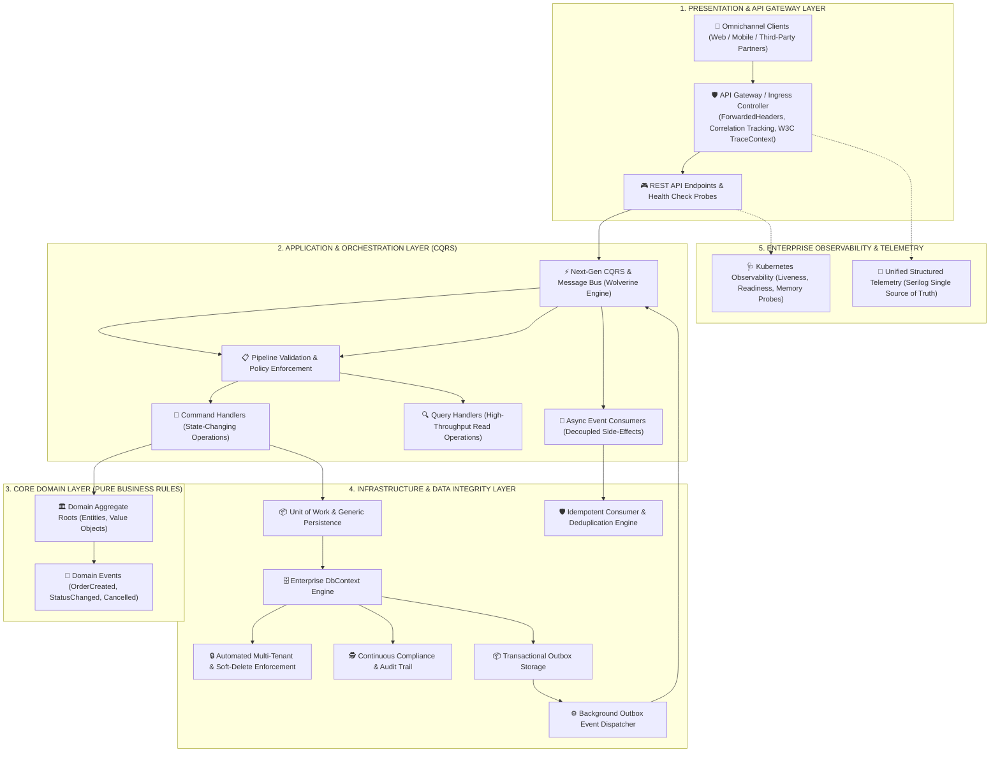
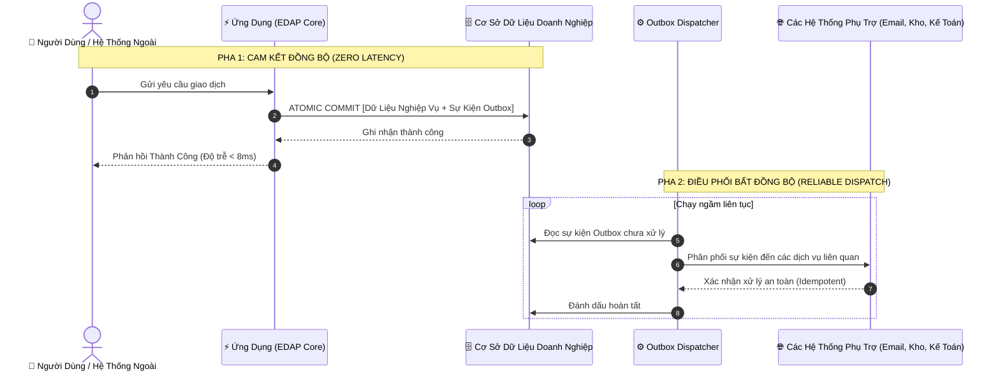

# 🏛️ ENTERPRISE DISTRIBUTED APPLICATION PLATFORM (EDAP)
### Khung Kiến Trúc Nền Tảng Phân Tán & Đa Thuê Bao Chuẩn Cloud-Native

[](#)
[](#)
[](#)
[](#)
[](#)
[](#)

---

## I. TẦM NHÌN CHIẾN LƯỢC & ĐỊNH VỊ NỀN TẢNG (STRATEGIC VISION)

Trong kỷ nguyên chuyển đổi số và kiến trúc phân tán (Distributed Microservices), các tổ chức quy mô lớn luôn đối mặt với 3 thách thức sống còn:
1. **Toàn Vẹn Dữ Liệu:** Làm thế nào để đảm bảo không thất thoát dữ liệu giữa các dịch vụ phân tán khi xảy ra sự cố mạng hoặc sập nguồn (*Zero Message Loss*).
2. **Khả Năng Mở Rộng & Hiệu Năng:** Duy trì độ trễ cực thấp (*Sub-10ms Latency*) khi lưu lượng giao dịch tăng trưởng đột biến.
3. **Phân Lập Đa Khách Hàng (Multi-Tenancy):** Đảm bảo an toàn và cách ly tuyệt đối dữ liệu giữa các chi nhánh, tổ chức hoặc khách hàng doanh nghiệp trên cùng một nền tảng hạ tầng dùng chung.

**Enterprise Distributed Application Platform (EDAP)** được xây dựng để trở thành **Bộ Khung Tiêu Chuẩn (Architecture Reference Foundation)** giải quyết trọn vẹn các thách thức trên, cung cấp nền móng vững chắc để phát triển nhanh chóng mọi dịch vụ nghiệp vụ cốt lõi của doanh nghiệp.

---

## II. KIẾN TRÚC TỔNG THỂ BẬC CAO (HIGH-LEVEL ARCHITECTURAL BLUEPRINT)

Hệ thống được thiết kế theo nguyên lý **Domain-Driven Design (DDD)** kết hợp **Clean Architecture** và **Event-Driven Architecture (EDA)**, đảm bảo tính độc lập tối đa giữa Logic nghiệp vụ và Hạ tầng công nghệ.



---

## III. 5 TRỤ CỘT NĂNG LỰC CỐT LÕI (CORE ARCHITECTURAL PILLARS)

---

### 1. Kiến Trúc Hướng Sự Kiện & Transactional Outbox (Zero Data Loss)
- **Giải quyết bài toán Dual-Write:** Khi thực hiện một giao dịch thay đổi trạng thái, hệ thống lưu trữ đồng thời Dữ liệu nghiệp vụ và các Sự kiện miền (*Domain Events*) vào **CÙNG MỘT TRANSACTION DATABASE**.
- **Cam kết At-Least-Once Delivery:** Đảm bảo 100% sự kiện được gửi đi thành công mà không bao giờ bị mất tin nhắn kể cả khi sự cố hạ tầng xảy ra.
- **Tối ưu hóa thời gian đáp ứng:** Phản hồi Client ngay lập tức trong **vài mili-giây**; các tác vụ phụ (Gửi thông báo, Tích điểm, Xử lý kho) được đẩy sang pha xử lý bất đồng bộ ngầm.



---

### 2. Cơ Chế Chống Xử Lý Trùng Lặp (Idempotent Consumer Engine)
- Trong môi trường mạng phân tán, việc thử lại (*Retry*) có thể khiến một thông điệp bị gửi nhiều lần.
- Nền tảng tích hợp sẵn **Bộ kiểm soát Idempotency cấp hạt nhân**. Mọi tác vụ nhạy cảm (Trừ tiền, Trừ kho, Hoàn tiền) đều được kiểm tra khóa định danh trước khi thực thi, **loại bỏ hoàn toàn rủi ro thao tác trùng lặp hoặc thất thoát tài chính**.

---

### 3. Phân Lập Đa Doanh Nghiệp (Multi-Tenancy & Data Privacy)
- **Tự động hóa hoàn toàn ở tầng lõi:** Áp dụng cơ chế *Global Query Filter* cấp Database. Mọi câu lệnh truy vấn dữ liệu đều tự động bị giới hạn trong phạm vi Tenant của người gọi.
- **Bảo mật tuyệt đối:** Lập trình viên nghiệp vụ không thể vô tình viết thiếu điều kiện lọc làm rò rỉ dữ liệu giữa các khách hàng/tổ chức doanh nghiệp khác nhau.
- **Toàn vẹn vòng đời:** Tự động hóa Audit Trail (Ai tạo, tạo lúc nào, ai sửa) và Xóa mềm (*Soft Delete*) phục vụ tuân thủ pháp lý.

---

### 4. Giám Sát, Vận Hành & Khả Năng Quan Sát (Observability & SRE Ready)
- **Single Source of Truth:** Chuẩn hóa toàn bộ nhật ký hệ thống về định dạng JSON có cấu trúc (*Structured Telemetry*), loại bỏ log rác, tối ưu 100% cho việc thu thập tự động vào **Elasticsearch, OpenTelemetry, Grafana Loki, Datadog**.
- **Distributed Tracing:** Tự động đính kèm `TraceId`, `SpanId`, `CorrelationId`, `ClientIp`, `TenantId` xuyên suốt mọi luồng xử lý.
- **Sẵn sàng cho Kubernetes (K8s-Native):** Tích hợp sẵn các cổng kiểm tra sức khỏe chuyên dụng:
  - `/health/live` *(Liveness Probe)*: Giám sát trạng thái tiến trình ứng dụng.
  - `/health/ready` *(Readiness Probe)*: Giám sát kết nối cơ sở dữ liệu và tài nguyên bộ nhớ.
  - `/health` *(Deep Metrics)*: Báo cáo dung lượng RAM, chu kỳ GC và độ trễ phục vụ cảnh báo tự động.

---

### 5. Quản Trị Chuẩn Hóa Giao Tiếp API (API Governance & Safe Operations)
- **Mô hình phản hồi đồng nhất:** 100% API trả về cấu trúc chuẩn mực (`success`, `code`, `message`, `data`, `errors`), giúp các đội ngũ Frontend / Mobile / Đối tác dễ dàng tích hợp.
- **Quy trình Xác nhận 2 Bước (2-Step Confirmation Flow):** Bảo vệ các giao dịch nhạy cảm/giá trị cao khỏi thao tác nhầm lẫn từ phía người dùng thông qua luồng xác nhận an toàn.

---

## IV. CÔNG NGHỆ & NGUYÊN TẮC THIẾT KẾ HỆ THỐNG

| Thành Phần | Công Nghệ / Mô Hình | Vai Trò & Lợi Ích Doanh Nghiệp |
| :--- | :--- | :--- |
| **Core Framework** | **.NET 10 (C# 14)** | Tận dụng tối đa hiệu năng biên dịch mới nhất, tiết kiệm tài nguyên máy chủ. |
| **Message & CQRS Engine** | **WolverineFx** | Bộ điều phối thông điệp thế hệ mới, biên dịch mã nguồn động siêu tốc thay thế MediatR. |
| **Persistence Engine** | **Entity Framework Core 10** | ORM chuẩn doanh nghiệp, hỗ trợ Unit of Work, Interceptors và Transaction Management. |
| **Data Integrity** | **Transactional Outbox & Idempotency** | Cam kết At-Least-Once Delivery, chống mất mát và trùng lặp thông điệp. |
| **Telemetry & Logging** | **Serilog Cloud-Native** | Nhật ký JSON có cấu trúc, tối ưu cho K8s Ingress, Pod Identity và SIEM/APM. |
| **Reliability Probes** | **ASP.NET Core Health Checks** | Tích hợp trực tiếp với Kubernetes Orchestrator và Prometheus Dashboard. |

---

## V. CẤU TRÚC MÃ NGUỒN CHUẨN DOANH NGHIỆP (CLEAN ARCHITECTURE)

```text
EDAP.Core/
├── Domain/                 # [DOANH NGHIỆP CỐT LÕI] Entities, Aggregates, Domain Events
│   ├── Common/             # BaseAuditableEntity, IDomainEvent, IMultiTenant, ISoftDeletable
│   ├── Events/             # Các sự kiện nghiệp vụ phát sinh trong hệ thống
│   └── [BoundedContexts]/  # Các Aggregate Roots quản lý quy tắc nghiệp vụ
│
├── Application/            # [ĐIỀU PHỐI NGHIỆP VỤ] Use Cases, CQRS Commands & Queries
│   ├── Commands/           # Xử lý các yêu cầu thay đổi trạng thái hệ thống
│   ├── Queries/            # Xử lý truy vấn dữ liệu hiệu năng cao (Automated Pagination)
│   ├── Events/             # Các Event Handlers xử lý tác vụ bất đồng bộ
│   ├── DTOs/               # Mô hình truyền tải dữ liệu
│   └── Common/             # ApiResponse, Interfaces chuẩn (IUnitOfWork, IRepository)
│
├── Infrastructure/         # [HẠ TẦNG KỸ THUẬT] Hiện thực hóa công nghệ & Lưu trữ
│   ├── BackgroundServices/ # Bộ xử lý Outbox chạy ngầm định kỳ
│   ├── Data/               # DbContext, Interceptors, Repositories, Outbox Entities
│   ├── Health/             # Bộ kiểm tra sức khỏe hệ thống (Memory, Database)
│   ├── Middleware/         # Quản lý Correlation ID, Forwarded Headers, Exception Handling
│   └── Services/           # Multi-Tenant Provider, Identity Context, Idempotency Engine
│
└── Presentation / API/     # [GIAO TIẾP NGOÀI] RESTful Gateway Controllers & OpenAPI Docs
```

---

## VI. ĐỊNH HƯỚNG MỞ RỘNG & PHÁT TRIỂN (STRATEGIC ROADMAP)

Hệ thống được thiết kế theo dạng **Mô-đun hóa cao (Highly Modular)**, sẵn sàng mở rộng cho các giai đoạn tiếp theo:
1. **Phân Phối Sự Kiện Đa Cụm (Enterprise Message Brokers):** Tích hợp Apache Kafka hoặc RabbitMQ làm hạ tầng truyền tin khi mở rộng quy mô đa trung tâm dữ liệu (Multi-Region Datacenter).
2. **Quản Lý Giao Dịch Bù Trừ Phân Tán (Saga Orchestration):** Mở rộng các chuỗi thanh toán phức tạp với mô hình Saga Compensating Transactions.
3. **Bảo Mật Tập Trung Cấp Doanh Nghiệp (IAM / OAuth2 / OIDC):** Tích hợp Keycloak / Azure Active Directory / Okta với chính sách phân quyền RBAC đa cấp độ.
4. **Bộ Nhớ Đệm Phân Tán 2 Lớp (Hybrid Caching):** Tích hợp L1 In-Memory + L2 Redis Cluster cho các điểm nghẽn dữ liệu đọc quy mô lớn.

---
*Tài liệu kiến trúc chính thức của Nền tảng Ứng dụng Phân tán Doanh nghiệp (Enterprise Distributed Application Platform).*
