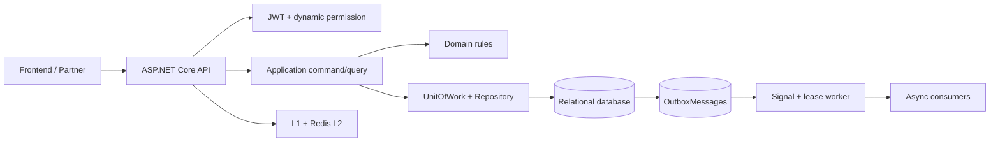

# System overview

## Đối tượng đọc

Kiến trúc sư, backend developer, reviewer và người cần hiểu boundary của hệ thống trước khi tích hợp hoặc mở rộng.

## Luồng xử lý chính

## Boundary

- `Domain`: không phụ thuộc ASP.NET Core, EF Core hay Redis. Chứa entity, enum, domain event và invariant.
- `Application`: chứa use case, command/query, DTO, validator và interface. Chỉ dùng `IUnitOfWork`, `IRepository<T>` và các port khác.
- `Controllers`: chuyển HTTP request thành command/query và đóng gói `ApiResponse<T>` hoặc file response.
- `Infrastructure/Persistence`: hiện thực `ApplicationDbContext`, UoW, repository, migrations và persistence models.
- `Infrastructure/Identity`, `Caching`, `Messaging`, `Reporting`: hiện thực các adapter kỹ thuật theo concern, không phải nơi chứa domain entity.

## Data consistency

Khi domain event phát sinh trong transaction, `ApplicationDbContext` ghi dữ liệu nghiệp vụ và outbox record cùng transaction. Sau commit, `OutboxSignal` đánh thức worker. Worker claim record bằng lease trong database, publish và retry với exponential backoff. Semantics là at-least-once; consumer bắt buộc idempotent.

## Multi-tenancy và identity

- User ID lấy từ claim `sub`/NameIdentifier.
- Tenant ID lấy từ claim `tenant_id` hoặc `tenant`.
- Không nhận tenant/user từ request header do client tự chọn.
- Query filter tự động scope dữ liệu multi-tenant.
- Gán role yêu cầu user có `TenantMembershipRecord` active trong tenant hiện tại.

## Cache

`HybridCacheService` dùng L1 local cache và L2 Redis khi được cấu hình. L1 production bị giới hạn tối đa 30 giây. Production fail-fast nếu thiếu `ConnectionStrings:Redis`.

## Giới hạn cần biết

- Provider hiện tại trong code là SQLite; production cần thay bằng PostgreSQL/SQL Server managed.
- Chưa có test project tự động trong repository.
- Outbox không phải exactly-once; không được dùng nó như cam kết consumer chỉ chạy một lần.
