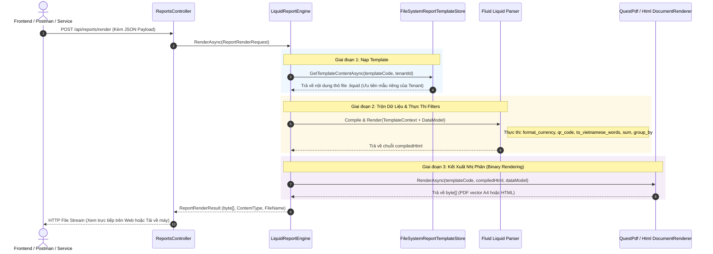

# 🚀 HƯỚNG DẪN KỸ THUẬT: INPUT, OUTPUT & LUỒNG XỬ LÝ BÁO CÁO CHO DEVELOPER
### (Developer Technical Reference: Data Flow, Input Contract, Processing Pipeline & Output)

> **Mục tiêu:** Cung cấp tài liệu kỹ thuật chuẩn xác, copy-paste được ngay cho lập trình viên Backend (.NET), Frontend (React/Vue/Angular) và QA/Tester khi làm việc với hệ thống Báo cáo & In ấn EDAP.

---

## 1. 🔄 SƠ ĐỒ LUỒNG DỮ LIỆU TỔNG THỂ (END-TO-END DATA FLOW)



---

## 2. 📥 INPUT: DỮ LIỆU ĐẦU VÀO ĐƯỢC TRUYỀN VÀO ĐÂU & NHƯ THẾ NÀO?

Hệ thống hỗ trợ **2 hình thức truyền Input**:

---

### HÌNH THỨC A: Truyền qua HTTP API (Dành cho Frontend / Postman / Mobile App)

- **Endpoint:** `POST /api/reports/render`
- **Headers:** 
  - `Authorization: Bearer <token>`
  - `Content-Type: application/json`
- **Cấu trúc Body (`ReportRenderRequest`):**

```json
{
  "templateCode": "Invoice_A4",
  "format": 0,
  "customTenantId": "hospital-bachmai",
  "dataModel": {
    "OrderNumber": "ORD-20260820-9999",
    "TenantId": "hospital-bachmai",
    "CustomerName": "Bệnh Viện Bạch Mai",
    "CustomerEmail": "contact@bachmai.gov.vn",
    "Status": "Completed",
    "CreatedAt": "2026-08-20T10:00:00Z",
    "TotalAmount": 101500.0,
    "Items": [
      {
        "ProductName": "Máy Siêu Âm 4D Doppler Màu",
        "Sku": "MED-US-4D",
        "Quantity": 1,
        "UnitPrice": 85000.0,
        "Total": 85000.0
      },
      {
        "ProductName": "Đầu Dò Tim Sector Phased Array",
        "Sku": "MED-PROBE-6S",
        "Quantity": 2,
        "UnitPrice": 6500.0,
        "Total": 13000.0
      },
      {
        "ProductName": "Gói Bảo Trì Kỹ Thuật 24 Tháng",
        "Sku": "SVC-MAINT-24M",
        "Quantity": 1,
        "UnitPrice": 3500.0,
        "Total": 3500.0
      }
    ]
  },
  "parameters": {
    "Watermark": "ĐÃ THANH TOÁN",
    "PrintCopies": 2
  }
}
```

#### Giải thích các trường Input:
| Tên trường | Kiểu dữ liệu | Bắt buộc | Ý nghĩa |
| :--- | :--- | :---: | :--- |
| **`templateCode`** | `string` | **Có** | Mã định danh của mẫu in (tương ứng tên file `.liquid` trong thư mục Templates). |
| **`format`** | `enum (int)` | **Có** | Định dạng xuất file: `0` = PDF, `1` = HTML Preview, `2` = Excel, `3` = CSV. |
| **`dataModel`** | `object` | **Có** | Đối tượng JSON chứa toàn bộ dữ liệu nghiệp vụ cần điền vào mẫu. Mọi thuộc tính trong JSON này sẽ được Liquid map 1-1 qua thẻ `{{ ThuộcTính }}`. |
| **`customTenantId`** | `string` | Không | Mã đơn vị muốn nạp mẫu đè riêng (nếu bỏ trống, hệ thống tự lấy `tenant_id` từ Token người dùng). |
| **`parameters`** | `dictionary` | Không | Các tham số phụ bổ sung (ví dụ: cờ Watermark, số liên in, màu in...). |

---

### HÌNH THỨC B: Gọi trực tiếp bằng C# Backend (Dành cho Background Job / Service)

Dành cho các tác vụ: **Tự động gửi email đính kèm hóa đơn PDF**, **Lưu trữ hồ sơ bệnh án vào AWS S3**, **In ấn hàng loạt ngầm**:

```csharp
public class OrderInvoiceService
{
    private readonly IReportEngine _reportEngine;

    public OrderInvoiceService(IReportEngine reportEngine)
    {
        _reportEngine = reportEngine;
    }

    public async Task ExportAndSaveInvoiceAsync(OrderDto orderDto)
    {
        // 1. Khởi tạo Input
        var request = new ReportRenderRequest(
            TemplateCode: "Invoice_A4",
            DataModel: orderDto,
            Format: ReportOutputFormat.Pdf
        );

        // 2. Kích hoạt động cơ Render
        ReportRenderResult result = await _reportEngine.RenderAsync(request);

        // 3. Sử dụng Output
        byte[] pdfBytes = result.Content;
        string fileName = result.FileName; // "Invoice_A4_20260820120000.pdf"
        string mimeType = result.ContentType; // "application/pdf"

        // Ví dụ: Lưu file ra ổ cứng hoặc đẩy lên Cloud S3
        await File.WriteAllBytesAsync($"C:/Invoices/{fileName}", pdfBytes);
    }
}
```

---

## 3. 📤 OUTPUT: KẾT QUẢ ĐẦU RA NHẬN ĐƯỢC LÀ GÌ?

### A. Khi nhận qua HTTP API (Trình duyệt / Mobile / Postman):
- **Trường hợp xuất PDF (`format: 0`):**
  - **HTTP Status:** `200 OK`
  - **Content-Type:** `application/pdf`
  - **Content-Disposition:** `inline; filename="Invoice_A4_20260820042019.pdf"`
  - **Body:** Binary Stream file PDF chuẩn in ấn vector A4. Trình duyệt sẽ tự động mở tab PDF Viewer có nút In / Tải về.
- **Trường hợp xuất HTML Preview (`format: 1`):**
  - **HTTP Status:** `200 OK`
  - **Content-Type:** `text/html; charset=utf-8`
  - **Body:** Toàn bộ mã nguồn HTML đã trộn sẵn dữ liệu, có mã QR Base64, định dạng tiền, đọc tiền thành chữ và JavaScript Client sẵn sàng gọi `window.print()`.

### B. Cấu trúc Object Output trong C# (`ReportRenderResult`):
```csharp
public record ReportRenderResult(
    byte[] Content,        // Mảng byte nhị phân của tài liệu (PDF hoặc HTML UTF-8)
    string ContentType,    // MIME type chuẩn ("application/pdf", "text/html; charset=utf-8")
    string FileName        // Tên file chuẩn hóa kèm timestamp ("Invoice_A4_20260820113000.pdf")
);
```

---

## 4. 🛠️ CHEATSHEET HƯỚNG DẪN DEV THỰC HIỆN TỪNG TÁC VỤ

### Tác vụ 1: Tạo thêm 1 mẫu báo cáo mới trong 2 phút
1. Tạo 1 file `.liquid` đặt tại: `WolverineApp/Infrastructure/Reporting/Templates/{MaBaoCao}.liquid`
2. Thiết kế layout HTML/CSS, đặt các biến `{{ TenTruong }}` khớp với thuộc tính trong DTO C#.
3. Sử dụng các filter có sẵn:
   - Tiền tệ: `{{ item.Price | format_currency: 'VND' }}`
   - Ngày tháng: `{{ item.Date | format_date: 'dd/MM/yyyy' }}`
   - Tiền bằng chữ: `{{ TotalAmount | to_vietnamese_words: 'đồng' }}`
   - Mã QR Code: ``
   - Tính tổng Subtotal: `{{ group.Items | sum: 'Total' | format_currency: 'VND' }}`
   - Gom nhóm: ``

### Tác vụ 2: Tùy biến mẫu riêng cho từng Bệnh viện / Chi nhánh (Multi-Tenant)
- Nếu **Bệnh viện Bạch Mai** (`tenant_id = "hospital-bachmai"`) cần mẫu riêng có Logo và chữ ký riêng:
  - Tạo thư mục con: `WolverineApp/Infrastructure/Reporting/Templates/hospital-bachmai/`
  - Đặt file trùng tên vào: `WolverineApp/Infrastructure/Reporting/Templates/hospital-bachmai/Invoice_A4.liquid`
- **Cơ chế tự động:** Khi bác sĩ/nhân viên Bạch Mai đăng nhập in phiếu, hệ thống tự động nạp mẫu riêng này. Tất cả các bệnh viện khác vẫn dùng mẫu chuẩn mặc định chung!
