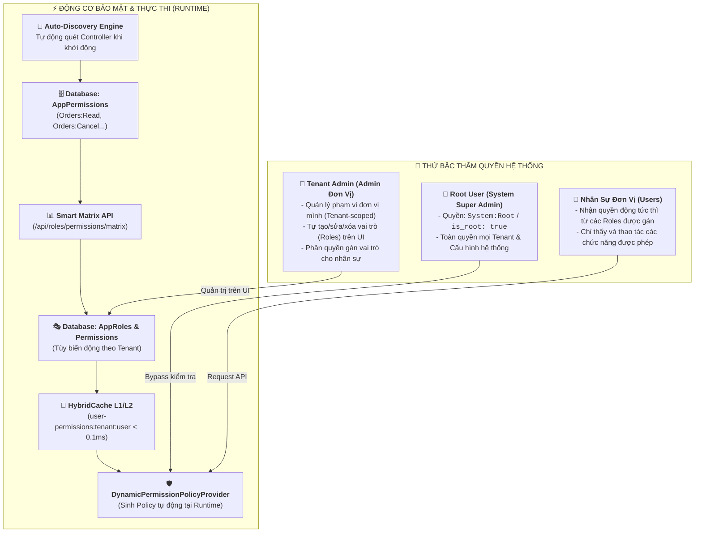

# BÁO CÁO TOÀN DIỆN KIẾN TRÚC PHÂN QUYỀN ĐỘNG (DYNAMIC RBAC & MULTI-TENANCY)

> **Dự án:** Enterprise Distributed Application Platform (EDAP)  
> **Phiên bản:** 2.0 (Zero-Declaration Dynamic RBAC)  
> **Framework:** .NET 10 (C# 14), ASP.NET Core Identity & Security, HybridCache, WolverineFx, EF Core  

---

## I. TỔNG QUAN MÔ HÌNH PHÂN QUYỀN HIỆN TẠI

Hệ thống đã loại bỏ hoàn toàn cơ chế phân quyền tĩnh (Hardcoded Enum/Roles) và chuyển sang **Mô hình Phân Quyền Động Đa Tầng (100% Zero-Declaration Dynamic RBAC)** đạt chuẩn Enterprise quốc tế:



---

## II. PHÂN BIỆT 3 THỰC THỂ CỐT LÕI: USER - ROLE - PERMISSION

| Khái niệm | Là gì trong hệ thống? | Ai định nghĩa? | Lưu ở đâu? | Ví dụ |
| :--- | :--- | :--- | :--- | :--- |
| **User** *(Người dùng)* | Danh tính tài khoản thực tế đăng nhập. | Khách hàng / Đơn vị. | JWT Claims / Database. | `alice_manager`, `david_sales`. |
| **Role** *(Vai trò / Chức danh)* | "Chiếc túi" gom nhóm nhiều quyền nghiệp vụ. | **Admin đơn vị tự tạo tùy ý trên UI**. | Bảng `AppRoles` (theo `TenantId`). | *"Kế toán trưởng"*, *"Trưởng khoa"*, *"Nhân viên kho"*. |
| **Permission** *(Quyền hạn)* | Một hành vi kỹ thuật nguyên tử trên API. | **Code Backend (Tự động phát hiện)**. | Bảng `AppPermissions`. | `Orders:Create`, `Orders:Cancel`, `Roles:Assign`. |

---

## III. CHI TIẾT 4 TẦNG TRIỂN KHAI KỸ THUẬT

### 1. Developer Viết Code (100% Sạch Bằng English i18n Keys)
Developer không cần sửa file cấu hình hay viết SQL. Chỉ cần gắn 2 Attribute ngắn gọn:
```csharp
[ApiController]
[Route("api/[controller]")]
[Authorize]
[PermissionResource("Orders", "Sales")] // Tài nguyên: Orders | Phân hệ: Sales
public class OrdersController : ControllerBase
{
    [HttpPost("create")]
    [HasPermission("Orders", "Create")] // Mã quyền: Orders:Create
    public async Task<IActionResult> CreateOrder(...) => ...;

    [HttpDelete("{id}/cancel")]
    [HasPermission("Orders", "Cancel")] // Mã quyền: Orders:Cancel
    public async Task<IActionResult> CancelOrder(...) => ...;
}
```

### 2. Auto-Discovery Engine (Tự Động Đồng Bộ Khi Khởi Động)
- Khi Server khởi động, `PermissionDiscoveryService` dùng Reflection quét toàn bộ Controller.
- Tự động kiểm tra và thêm các mã quyền mới (`Orders:Read`, `Orders:Cancel`, `Roles:Assign`...) vào bảng `AppPermissions` trong Database.
- Khi Developer thêm một API mới và deploy, quyền đó tự động xuất hiện trên màn hình phân quyền của Admin mà không cần chạy migration bằng tay.

### 3. Smart Matrix API Cho Giao Diện UI (`GET /api/roles/permissions/matrix`)
Backend trả về dữ liệu 2D gồm **Cột (Actions)** và **Dòng (Resources)**:

| Phân hệ / Chức năng | Xem (`Read`) | Thêm (`Create`) | Sửa (`Update`) | Xóa (`Delete`) | Hủy (`Cancel`) | Gán vai trò (`Assign`) |
| :--- | :---: | :---: | :---: | :---: | :---: | :---: |
| **1. Quản lý Đơn hàng (Sales)** | $\mathbf{\Box}$ | $\mathbf{\Box}$ | $\mathbf{\Box}$ | <span style="color:#aaa;">—</span> | $\mathbf{\Box}$ | <span style="color:#aaa;">—</span> |
| **2. Quản lý Vai trò (IAM)** | $\mathbf{\Box}$ | $\mathbf{\Box}$ | $\mathbf{\Box}$ | $\mathbf{\Box}$ | <span style="color:#aaa;">—</span> | $\mathbf{\Box}$ |
| **3. Nhật ký kiểm toán (Audit)**| $\mathbf{\Box}$ | <span style="color:#aaa;">—</span> | <span style="color:#aaa;">—</span> | <span style="color:#aaa;">—</span> | <span style="color:#aaa;">—</span> | <span style="color:#aaa;">—</span> |

- Ô có trong API $\rightarrow$ Frontend render ô Checkbox $\mathbf{\Box}$.
- Ô không có tính năng thật (như *AuditLogs - Cancel*) $\rightarrow$ Frontend render dấu gạch ngang `—` (Disable).

### 4. Dynamic Policy Provider & HybridCache (< 0.1ms)
- `DynamicPermissionPolicyProvider` tự động tạo Authorization Policy tại Runtime cho bất kỳ mã quyền nào.
- Quyền của User được cache tại RAM L1 + Redis L2 với tag `tenant-permissions:{tenantId}`.
- **Cập nhật tức thì (Zero-Downtime):** Khi Admin sửa quyền của một Role trên UI $\rightarrow$ Cache của đơn vị bị hủy ngay lập tức $\rightarrow$ Nhân viên nhận quyền mới ngay trong request tiếp theo mà không cần đăng xuất lại!

---

## IV. BẢNG TRA CỨU DANH MỤC API & QUYỀN HẠN BẢO VỆ

| Module | Endpoint | Method | Mã quyền bảo vệ | Mô tả |
| :--- | :--- | :--- | :--- | :--- |
| **Auth** | `/api/auth/token` | `POST` | *AllowAnonymous* | Đăng nhập lấy Token (Hỗ trợ Root User & User đơn vị) |
| **Auth** | `/api/auth/me` | `GET` | *Authenticated* | Lấy thông tin tài khoản, đơn vị và danh sách quyền |
| **IAM** | `/api/roles/permissions/matrix` | `GET` | *AllowAnonymous* | Lấy cấu trúc Ma trận Smart Matrix để UI vẽ bảng checkbox |
| **IAM** | `/api/roles/permissions` | `GET` | *Authenticated* | Lấy danh mục tất cả quyền có trong hệ thống |
| **IAM** | `/api/roles` | `GET` | `Roles:Read` | Lấy danh sách vai trò động của đơn vị hiện tại |
| **IAM** | `/api/roles/{id}` | `GET` | `Roles:Read` | Lấy chi tiết vai trò và danh sách quyền đã gán |
| **IAM** | `/api/roles` | `POST` | `Roles:Create` | Tạo vai trò mới cho đơn vị kèm danh sách quyền |
| **IAM** | `/api/roles/{id}` | `PUT` | `Roles:Update` | Cập nhật vai trò và cấu hình lại danh sách quyền |
| **IAM** | `/api/roles/{id}` | `DELETE` | `Roles:Delete` | Xóa vai trò tùy biến của đơn vị |
| **IAM** | `/api/roles/assign` | `POST` | `Roles:Assign` | Gán danh sách vai trò cho người dùng trong đơn vị |
| **Sales** | `/api/orders/create` | `POST` | `Orders:Create` | Tạo đơn hàng mới (Hỗ trợ `Idempotency-Key`) |
| **Sales** | `/api/orders/list` | `GET` | `Orders:Read` | Lấy danh sách đơn hàng có phân trang |
| **Sales** | `/api/orders/{id}` | `GET` | `Orders:Read` | Lấy chi tiết một đơn hàng |
| **Sales** | `/api/orders/{id}/status` | `PUT` | `Orders:Update` | Cập nhật trạng thái đơn hàng |
| **Sales** | `/api/orders/{id}/cancel` | `DELETE` | `Orders:Cancel` | Hủy đơn hàng (Quy trình xác nhận 2 bước) |
| **Sales** | `/api/orders/statistics/summary` | `GET` | `Orders:Read` | Thống kê tổng hợp đơn hàng |
| **Audit** | `/api/auditlogs/list` | `GET` | `AuditLogs:Read` | Xem lịch sử nhật ký kiểm toán hệ thống |

---

## V. CẤU TRÚC BẢNG DỮ LIỆU DATABASE (SCHEMA)

```sql
-- 1. Bảng danh mục quyền hạn hệ thống (Tự động đồng bộ qua Auto-Discovery)
CREATE TABLE Permissions (
    Id TEXT PRIMARY KEY,
    Code TEXT UNIQUE NOT NULL,       -- "Orders:Read", "Orders:Cancel"
    Module TEXT NOT NULL,            -- "Sales", "IAM", "Audit", "System"
    Resource TEXT NOT NULL,          -- "Orders", "Roles", "AuditLogs"
    Action TEXT NOT NULL,            -- "Read", "Create", "Cancel"
    IsAutoDiscovered INTEGER NOT NULL,
    IsSystem INTEGER NOT NULL,
    CreatedAt TEXT NOT NULL
);

-- 2. Bảng vai trò động theo từng đơn vị
CREATE TABLE Roles (
    Id TEXT PRIMARY KEY,
    Name TEXT NOT NULL,              -- Tên do Admin đơn vị đặt: "KeToanTruong", "BacSi"
    Description TEXT,
    TenantId TEXT NOT NULL,          -- Đơn vị sở hữu vai trò
    IsSystemRole INTEGER NOT NULL,
    CreatedAt TEXT NOT NULL,
    UNIQUE(TenantId, Name)
);

-- 3. Bảng quyền gán cho từng vai trò
CREATE TABLE RolePermissions (
    Id TEXT PRIMARY KEY,
    RoleId TEXT NOT NULL,
    PermissionCode TEXT NOT NULL,    -- "Orders:Read"
    TenantId TEXT NOT NULL,
    FOREIGN KEY(RoleId) REFERENCES Roles(Id) ON DELETE CASCADE,
    UNIQUE(RoleId, PermissionCode)
);

-- 4. Bảng gán vai trò cho người dùng
CREATE TABLE UserRoles (
    Id TEXT PRIMARY KEY,
    UserId TEXT NOT NULL,            -- Username hoặc GUID của nhân sự
    RoleId TEXT NOT NULL,
    TenantId TEXT NOT NULL,
    FOREIGN KEY(RoleId) REFERENCES Roles(Id) ON DELETE CASCADE,
    UNIQUE(TenantId, UserId, RoleId)
);
```

---

## VI. KẾT LUẬN & ĐÁNH GIÁ MỨC ĐỘ PRODUCTION-READY

1. **Tính linh hoạt (Flexibility):** 100% không còn hardcode vai trò; bất kỳ đơn vị triển khai nào cũng có thể tự xây dựng cây ma trận phân quyền phù hợp với cơ cấu tổ chức riêng của mình.
2. **Khả năng mở rộng (Extensibility):** Thêm tính năng/API mới chỉ cần gắn `[HasPermission]`, toàn bộ hệ thống từ Database đến Giao diện Ma trận Checkbox tự động cập nhật.
3. **Hiệu năng & An ninh (Performance & Security):** Kiểm tra quyền siêu tốc qua L1/L2 HybridCache (< 0.1ms), bảo vệ 2 lớp (Authentication JWT + Dynamic RBAC Policy), phân lập đa đơn vị (Multi-Tenancy) tuyệt đối.
