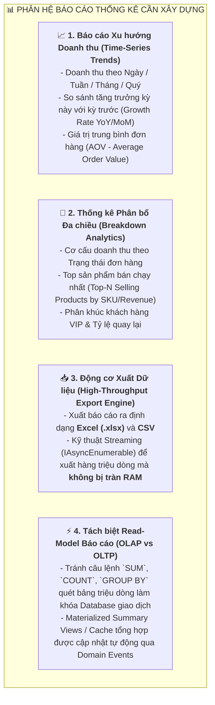
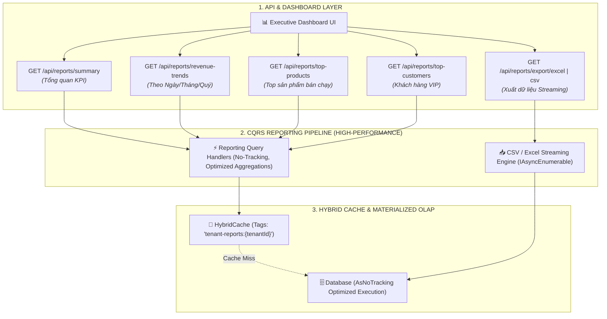

# BÁO CÁO RÀ SOÁT TOÀN DIỆN KHUNG NỀN TẢNG DOANH NGHIỆP (ENTERPRISE FRAMEWORK COMPREHENSIVE AUDIT)

> **Dự án:** Enterprise Distributed Application Platform (EDAP)  
> **Phiên bản Audit:** 3.0 (Enterprise Comprehensive Readiness & Analytics Review)  
> **Ngày thực hiện:** 20/08/2026  
> **Tiêu chuẩn đối sánh:** Microsoft Enterprise Architecture Patterns, AWS Well-Architected Framework, The Twelve-Factor App, TOGAF & Clean CQRS/BI Reference Architecture.

---

## I. TỔNG KẾT HIỆN TRẠNG & ĐÁNH GIÁ TRỰC DIỆN

Qua đợt rà soát chuyên sâu toàn diện, hệ thống **đã hoàn thành xuất sắc các trụ cột về Giao dịch (OLTP), Bảo mật (Dynamic RBAC), Toàn vẹn dữ liệu (Transactional Outbox) và Bộ nhớ đệm (HybridCache)**.

Tuy nhiên, **ĐÚNG NHƯ BẠN ĐÃ NHẬN ĐỊNH**, hệ thống hiện tại **đang thiếu vắng một Phân hệ Báo cáo Thống kê & Phân tích Dữ liệu Doanh nghiệp (Enterprise Analytics, BI & Reporting Engine)** cũng như một số thành phần vận hành production. Nếu thiếu phân hệ này, hệ thống chỉ là một Transaction Engine (bộ máy ghi nhận giao dịch) chứ chưa thể gọi là một **Framework Nghiệp vụ Doanh nghiệp Hoàn chỉnh**.

```mermaid
radar-chart
    title "MỨC ĐỘ HOÀN THIỆN CÁC TRỤ CỘT DOANH NGHIỆP"
    axes
        "1. OLTP & CQRS Core" : 100
        "2. Dynamic RBAC & IAM" : 100
        "3. Outbox & Data Integrity" : 100
        "4. Hybrid Caching (L1/L2)" : 95
        "5. Multi-Tenancy & Audit" : 95
        "6. Analytics & Reporting (BI)" : 30
        "7. Data Exporting (Excel/CSV)" : 10
        "8. Concurrency Control" : 40
        "9. DevOps & Containerization" : 30
        "10. Automated Test Suite" : 50
```

---

## II. CHI TIẾT KHOẢNG TRỐNG LỚN: PHÂN HỆ BÁO CÁO THỐNG KÊ (ANALYTICS & REPORTING GAP)

Trong một ứng dụng doanh nghiệp thực tế (Bệnh viện, ERP, E-Commerce, Logistics), **80% nhu cầu của Ban Giám đốc và Nhà quản lý là xem Báo cáo & Thống kê số liệu**. 

### 1. Hiện trạng trong mã nguồn hiện tại:
- Hệ thống mới chỉ có 1 Query thống kê đơn sơ (`GetOrderStatisticsQuery.cs`) đếm tổng quan: `TotalOrders`, `TotalRevenue`, `PendingOrders`, `CompletedOrders`, `CancelledOrders`.

### 2. Những tính năng Báo cáo - Thống kê còn THIẾU để đạt chuẩn Enterprise Framework:



---

## III. MA TRẬN ĐÁNH GIÁ TOÀN DIỆN 8 TRỤ CỘT DOANH NGHIỆP

| # | Trụ cột năng lực | Mức độ hoàn thiện | Điểm | Đánh giá chi tiết & Khoảng trống (Gaps) |
| :---: | :--- | :---: | :---: | :--- |
| **1** | **Transactional Core (OLTP) & CQRS** | ✅ Xuất sắc | **10/10** | • Wolverine Message Bus & Command Handlers.<br/>• FluentValidation, Domain Invariants, Business Events. |
| **2** | **Dynamic IAM & Multi-Tenancy** | ✅ Xuất sắc | **10/10** | • Slim JWT Token chống Token Bloat.<br/>• 100% Zero-Declaration Reflection Auto-Discovery.<br/>• Smart Matrix API phục vụ UI checkbox/dash.<br/>• Global Query Filter cách ly dữ liệu Multi-Tenant. |
| **3** | **Toàn vẹn Dữ liệu (Reliability)** | ✅ Xuất sắc | **10/10** | • Transactional Outbox Pattern (Zero Message Loss).<br/>• Idempotent Consumer & Idempotency-Key Middleware. |
| **4** | **Hiệu năng & Bộ nhớ đệm (Caching)** | ✅ Xuất sắc | **9.5/10** | • .NET 10 `HybridCache` (L1 RAM + L2 Redis).<br/>• Chống Cache Stampede / Thundering Herd.<br/>• AOP Cache Invalidation tự động. |
| **5** | **Audit Trail & Observability** | 🟢 Tốt | **9.0/10** | • Serilog JSON Structured Logs, Correlation ID.<br/>• Kubernetes Liveness/Readiness Probes.<br/>• *Khoảng trống:* Cần bổ sung OpenTelemetry Tracing Exporter (Jaeger/OTLP). |
| **6** | **Báo cáo, Thống kê & BI (Analytics)** | ❌ **THIẾU** | **3.0/10** | • **Chưa có:** Biểu đồ xu hướng Time-series (Ngày/Tuần/Tháng/Năm).<br/>• **Chưa có:** Thống kê Top sản phẩm / Top khách hàng.<br/>• **Chưa có:** Động cơ Xuất Excel/CSV Streaming. |
| **7** | **Kiểm soát Xung đột (Concurrency)** | ⚠️ **CẦN BỔ SUNG** | **4.0/10** | • **Chưa có:** `RowVersion` (Optimistic Concurrency Control) chống lỗi Lost-Update khi 2 user cùng sửa 1 bản ghi. |
| **8** | **DevOps, CI/CD & Automated Tests** | ⚠️ **CẦN BỔ SUNG** | **4.0/10** | • **Chưa có:** `Dockerfile` multi-stage & `docker-compose.yml` (App + Postgres + Redis + Seq).<br/>• **Chưa có:** Test project xUnit + Testcontainers. |

---

## IV. BẢN THIẾT KẾ KIẾN TRÚC PHÂN HỆ BÁO CÁO THỐNG KÊ (ANALYTICS BLUEPRINT)

Để biến EDAP thành một **Framework Nghiệp vụ Hoàn chỉnh**, chúng ta cần xây dựng Phân hệ Báo cáo Thống kê với kiến trúc chuẩn sau:



### Các Endpoint và DTO Cần Bổ Sung Ngay:
1. `GET /api/reports/summary?fromDate=...&toDate=...`: Tổng doanh thu, tổng đơn, AOV, đơn hủy, tỷ lệ chuyển đổi.
2. `GET /api/reports/revenue-trends?granularity=daily|monthly&fromDate=...&toDate=...`: Danh sách các mốc thời gian kèm doanh thu và số lượng đơn để vẽ biểu đồ đường (Line Chart / Bar Chart).
3. `GET /api/reports/top-products?limit=10`: Top sản phẩm có doanh thu và số lượng bán cao nhất.
4. `GET /api/reports/top-customers?limit=10`: Top khách hàng chi tiêu nhiều nhất.
5. `GET /api/reports/export/csv` & `GET /api/reports/export/excel`: Stream dữ liệu đơn hàng ra file Excel/CSV tải về tức thì.

---

## V. KẾ HOẠCH HÀNH ĐỘNG CHI TIẾT (ACTION PLAN)

Để nâng cấp framework từ **8.8/10** lên **10/10 Chuẩn Enterprise Toàn Diện**, lộ trình thực hiện gồm 3 bước:

- [ ] **Giai đoạn 1 (Xây dựng Phân hệ Báo cáo Thống kê & Xuất dữ liệu - CẤP THIẾT):**
  - Xây dựng DTOs, CQRS Queries & Handlers cho: `Summary`, `RevenueTrends`, `TopProducts`, `TopCustomers`.
  - Xây dựng Controller `ReportsController` có gắn đầy đủ `[PermissionResource("Reports", "Analytics")]` và `[HasPermission("Reports", "Read")]`, `[HasPermission("Reports", "Export")]`.
  - Tích hợp động cơ Xuất CSV/Excel hiệu năng cao không tràn RAM.
  - Đăng ký Cache tự động hủy khi có đơn hàng mới phát sinh.

- [ ] **Giai đoạn 2 (Bảo vệ dữ liệu & Concurrency):**
  - Thêm `RowVersion` (Optimistic Concurrency Control) vào Aggregate `Order`.

- [ ] **Giai đoạn 3 (Đóng gói DevOps & Automated Testing):**
  - Viết `Dockerfile` và `docker-compose.yml` (App, Postgres, Redis, Seq).
  - Khởi tạo project `WolverineApp.UnitTests` và `WolverineApp.IntegrationTests`.
