# 📊 CẨM NANG SO SÁNH & CHUYỂN ĐỔI JASPERREPORTS SANG LIQUID TEMPLATE
## (JASPERREPORTS VS LIQUID: ADVANCED GROUPING, TOTALS & BAND ARCHITECTURE)

> **Dành cho:** Kiến trúc sư Hệ thống, Lập trình viên Doanh nghiệp và Chuyên gia Báo cáo HIS / ERP.  
> **Mục tiêu:** Ánh xạ 100% tất cả các tính năng đặc thù của JasperReports (`.jrxml`) sang Liquid + HTML5/CSS3 Paged Media trong nền tảng EDAP.

---

## I. BẢNG ĐỐI CHIẾU 1-1: 9 DẢI BĂNG (BANDS) TRONG JASPERREPORTS SANG LIQUID

Trong JasperReports, cấu trúc tài liệu được chia thành các **Bands (Dải băng)**. Dưới đây là cách ánh xạ chính xác 1-1 sang cấu trúc Semantic HTML + CSS trong Liquid:

```mermaid
graph TD
    subgraph JASPER_BANDS ["🦖 9 DẢI BĂNG JASPERREPORTS (.jrxml)"]
        J_Title["1. Title Band"]
        J_PageHeader["2. Page Header Band"]
        J_ColHeader["3. Column Header Band"]
        J_GroupHeader["4. Group Header Band"]
        J_Detail["5. Detail Band"]
        J_GroupFooter["6. Group Footer Band"]
        J_ColFooter["7. Column Footer Band"]
        J_Summary["8. Summary Band"]
        J_PageFooter["9. Page Footer Band"]
    end

    subgraph LIQUID_HTML ["🚀 TƯƠNG ỨNG TRONG LIQUID & HTML/CSS"]
        L_Title["<code>&lt;header class='doc-title'&gt;</code><br/>Tiêu đề & Logo (Chỉ xuất hiện trang 1)"]
        L_PageHeader["<code>@page { @top-center { ... } }</code> hoặc <code>&lt;div class='page-header'&gt;</code><br/>Tiêu ngữ & Tên đơn vị (Lặp lại đầu mỗi trang)"]
        L_ColHeader["<code>&lt;thead&gt; &lt;tr&gt; &lt;th&gt;...&lt;/th&gt; &lt;/tr&gt; &lt;/thead&gt;</code><br/>Tiêu đề cột (Tự động lặp lại khi bảng tràn sang trang 2, 3)"]
        L_GroupHeader["<code>{% for group in Items | group_by: 'Category' %}</code><br/><code>&lt;tr class='group-header'&gt;...&lt;/tr&gt;</code>"]
        L_Detail["<code>{% for item in group.Items %}</code><br/><code>&lt;tr class='detail-row'&gt;...&lt;/tr&gt;</code>"]
        L_GroupFooter["<code>&lt;tr class='subtotal-row'&gt;</code><br/>Tổng phụ nhóm: <code>{{ group.Items | sum: 'Total' }}</code>"]
        L_ColFooter["<code>&lt;tfoot&gt; &lt;tr&gt; &lt;td&gt;...&lt;/td&gt; &lt;/tr&gt; &lt;/tfoot&gt;</code><br/>Chân bảng cố định"]
        L_Summary["<code>&lt;section class='summary-section'&gt;</code><br/>Tổng tiền toàn viện, Tiền bằng chữ, Chữ ký 3 bên"]
        L_PageFooter["<code>@page { @bottom-right { ... } }</code> hoặc <code>QuestPDF Footer</code><br/>Đánh số trang 'Trang X / Y', Mã vạch chân trang"]
    end

    J_Title --> L_Title
    J_PageHeader --> L_PageHeader
    J_ColHeader --> L_ColHeader
    J_GroupHeader --> L_GroupHeader
    J_Detail --> L_Detail
    J_GroupFooter --> L_GroupFooter
    J_ColFooter --> L_ColFooter
    J_Summary --> L_Summary
    J_PageFooter --> L_PageFooter
```



---

## II. GOM NHÓM & TÍNH TỔNG PHỤ (GROUPING, SUBTOTALS & RUNNING TOTALS)

Trong JasperReports, bạn phải tạo `<group name="GroupCategory">` và khai báo các `<variable calculation="Sum" resetType="Group">`. 

Trong Liquid EDAP, bạn có thể thực hiện **cực kỳ trực quan bằng 2 cách**:

### Cách 1: Dùng Bộ Lọc Tích Hợp Sẵn (`group_by` và `sum`)
```liquid
<!-- 1. Gom nhóm danh sách theo cột 'Department' (Khoa/Phòng) -->


<table class="report-table">
    <thead>
        <tr>
            <th style="width: 5%;">STT</th>
            <th style="width: 45%;">Tên Thuốc / Dịch Vụ</th>
            <th style="width: 15%;">Số Lượng</th>
            <th style="width: 15%;">Đơn Giá</th>
            <th style="width: 20%;">Thành Tiền</th>
        </tr>
    </thead>
    <tbody>
        
            <!-- GROUP HEADER BAND: In tên nhóm và số lượng bệnh nhân -->
            <tr class="group-header">
                <td colspan="5">
                    🏢 <strong>KHOA: {{ group.Key | upcase }}</strong> 
                    <span class="badge">({{ group.Count }} dịch vụ)</span>
                </td>
            </tr>

            <!-- DETAIL BAND: In từng dòng chi tiết của nhóm -->
            
            <tr class="detail-row">
                <td class="text-center">{{ forloop.index }}</td>
                <td>{{ item.ProductName }}</td>
                <td class="text-center">{{ item.Quantity }}</td>
                <td class="text-right">{{ item.UnitPrice | format_currency: 'VND' }}</td>
                <td class="text-right">{{ item.Total | format_currency: 'VND' }}</td>
            </tr>
            

            <!-- GROUP FOOTER BAND: Tính tổng phụ (Subtotal) của riêng Khoa này -->
            <tr class="group-footer">
                <td colspan="4" class="text-right">
                    <strong>Tổng cộng Khoa {{ group.Key }}:</strong>
                </td>
                <td class="text-right subtotal-val">
                    <!-- Tính tổng trường 'Total' của group.Items trong 1 dòng -->
                    <strong>{{ group.Items | sum: 'Total' | format_currency: 'VND' }}</strong>
                </td>
            </tr>
        
    </tbody>

    <!-- REPORT SUMMARY / GRAND TOTAL: Tổng toàn viện -->
    <tfoot>
        <tr class="grand-total-row">
            <td colspan="4" class="text-right"><strong>TỔNG TOÀN VIỆN:</strong></td>
            <td class="text-right grand-total-val">
                <strong>{{ Prescriptions | sum: 'Total' | format_currency: 'VND' }}</strong>
            </td>
        </tr>
    </tfoot>
</table>
```

---

### Cách 2: Tính Toán Tích Lũy Dồn (Running Sum & Average) Bằng Biến Liquid
Nếu bạn muốn tính số dư tích lũy hoặc giá trị trung bình qua từng dòng:

```liquid




    <!-- Cộng dồn từng dòng (Running Balance) -->
    
    
    
    <tr>
        <td>{{ item.ProductName }}</td>
        <td>{{ item.Total | format_currency: 'USD' }}</td>
        <!-- Cột số dư tích lũy dồn đến dòng hiện tại -->
        <td class="text-right"><i>{{ running_balance | format_currency: 'USD' }}</i></td>
    </tr>


<!-- Tính giá trị đơn hàng trung bình (Average) -->

<p>Giá trị trung bình mỗi mặt hàng: <b>{{ avg_item_price | format_currency: 'USD' }}</b></p>
```

---

## III. KỸ THUẬT LẶP LẠI ĐẦU BẢNG (COLUMN HEADER) & CHÂN BẢNG TRÊN TỪNG TRANG IN

Một vấn đề sống còn khi in báo cáo danh sách dài hàng trăm trang: **Làm sao để tiêu đề cột (STT, Tên hàng, Đơn giá...) tự động xuất hiện ở đầu mỗi trang in?**

### Giải pháp CSS Paged Media:
Trong chuẩn in ấn HTML5/CSS3, bạn chỉ cần khai báo chuẩn thẻ `<thead>` và `<tbody>`:

```css
/* Ép trình duyệt và engine PDF lặp lại thead ở đầu mỗi trang in mới */
thead {
    display: table-header-group;
}

/* Ép lặp lại tfoot ở cuối mỗi trang in */
tfoot {
    display: table-footer-group;
}

/* Chống rách dòng: Không bao giờ cắt đôi 1 dòng tr khi chuyển trang */
tr {
    page-break-inside: avoid;
    break-inside: avoid;
}

/* Chống mồ côi tiêu đề nhóm (Group Header không bao giờ nằm trơ trọi ở đáy trang) */
.group-header {
    page-break-after: avoid;
    break-after: avoid;
}
```

---

## IV. ĐÁNH SỐ TRANG ĐỘNG (PAGE X OF Y) & RESET SỐ TRANG THEO NHÓM

### 1. Đánh số trang toàn cục (Trang X / Tổng số trang Y)
- **Trong QuestPDF Engine:**
  ```csharp
  page.Footer().AlignRight().Text(txt =>
  {
      txt.Span("Trang ");
      txt.CurrentPageNumber();
      txt.Span(" / ");
      txt.TotalPages();
  });
  ```
- **Trong CSS Paged Media (In Web / Puppeteer):**
  ```css
  @page {
      @bottom-right {
          content: "Trang " counter(page) " / " counter(pages);
          font-size: 10px;
          color: #777;
      }
  }
  ```

### 2. Ép ngắt trang (Page Break) theo từng Bệnh nhân / Đơn hàng
Khi in hàng loạt phiếu xuất kho hoặc bệnh án của nhiều người trong cùng 1 file:
```html

    <div class="patient-record" style="page-break-before: always;">
        <!-- Bệnh nhân mới luôn bắt đầu ở 1 trang in mới toanh -->
        <h2>HỒ SƠ BỆNH ÁN: {{ patient.FullName }}</h2>
        ...
    </div>

```

---

## V. BẢNG ĐỐI CHIẾU CÁC HÀM THỐNG KÊ (JASPER VARIABLES VS LIQUID FILTERS)

| Tính năng trong JasperReports | Cú pháp trong JRXML | Cú pháp tương đương trong Liquid EDAP |
| :--- | :--- | :--- |
| **Tính Tổng (SUM)** | `<variable calculation="Sum">` | `{{ Items \| sum: 'Total' }}` |
| **Đếm số dòng (COUNT)** | `<variable calculation="Count">` | `{{ Items.size }}` hoặc `{{ group.Count }}` |
| **Tính Trung Bình (AVG)** | `<variable calculation="Average">` | `{{ Items \| sum: 'Total' \| divided_by: Items.size }}` |
| **Gom nhóm (GROUP BY)** | `<group name="DeptGroup">` | `` |
| **Format tiền tệ** | `new DecimalFormat("#,##0")` | `{{ val \| format_currency: 'VND' }}` |
| **Format ngày tháng** | `new SimpleDateFormat("dd/MM/yyyy")` | `{{ val \| format_date: 'dd/MM/yyyy' }}` |
| **Đọc tiền thành chữ** | Viết Java Scriptlet phức tạp | `{{ val \| to_vietnamese_words: 'đồng' }}` |
| **Sinh mã Barcode / QR** | Barbecue / Barcode4J Component | `{{ val \| qr_code }}` |
| **Lặp lại Header khi sang trang**| `isReprintHeaderOnEachPage="true"` | `thead { display: table-header-group; }` |
| **Chống rách bảng sang trang** | `isKeepTogether="true"` | `tr { page-break-inside: avoid; }` |

---

## VI. KẾT LUẬN & ĐÁNH GIÁ

- **100% tính năng của JasperReports** (Gom nhóm, Tổng phụ Subtotal, Lặp lại Header, Đánh số trang X/Y, Ngắt trang động) đều được **thực hiện dễ dàng và ngắn gọn hơn rất nhiều** trong Liquid Engine của EDAP.
- **Không phụ thuộc Java:** Chạy trực tiếp siêu tốc trong .NET 10, tiêu tốn cực ít RAM (< 2MB) và hoàn toàn kiểm soát được trên Git.
