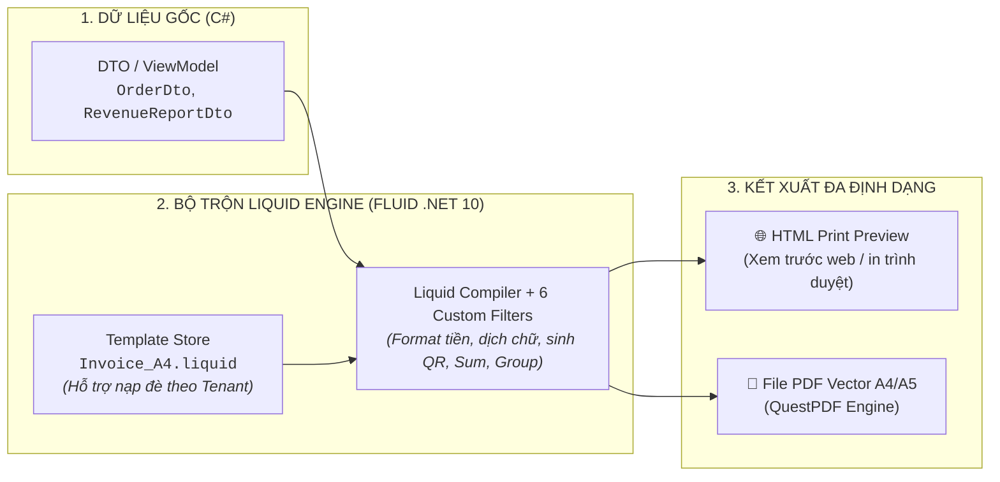

# 📘 SỔ TAY HƯỚNG DẪN THIẾT KẾ & LẬP TRÌNH BÁO CÁO LIQUID TỪ A ĐẾN Z
### (THE DEFINITIVE GUIDE TO LIQUID REPORTING & JASPERREPORTS MIGRATION IN EDAP)

> **Dành cho:** Lập trình viên Backend (.NET), Frontend Designer, Kỹ sư Báo cáo Doanh nghiệp / HIS / ERP và Quản trị viên Hệ thống.  
> **Áp dụng cho:** Enterprise Distributed Application Platform (EDAP Core Engine).  
> **Công nghệ:** Liquid Template (Fluid .NET 10) + QuestPDF Vector Engine + HTML5/CSS3 Paged Media.

---

## 📑 MỤC LỤC
1. [Tổng Quan & Nguyên Lý Hoạt Động](#1-tổng-quan--nguyên-lý-hoạt-động)
2. [Cú Pháp Liquid Cốt Lõi (Cheatsheet Từ A đến Z)](#2-cú-pháp-liquid-cốt-lõi-cheatsheet-từ-a-đến-z)
3. [Bảng Đối Chiếu 1-1: 9 Dải Băng (Bands) JasperReports Sang Liquid & HTML/CSS](#3-bảng-đối-chiếu-1-1-9-dải-băng-bands-jasperreports-sang-liquid--htmlcss)
4. [Gom Nhóm Đa Cấp & Các Hàm Thống Kê (Group By, Subtotals & Running Sum)](#4-gom-nhóm-đa-cấp--các-hàm-thống-kê-group-by-subtotals--running-sum)
5. [Kỹ Thuật Lặp Lại Đầu Bảng (`thead`), Chân Bảng (`tfoot`) & Chống Rách Trang](#5-kỹ-thuật-lặp-lại-đầu-bảng-thead-chân-bảng-tfoot--chống-rách-trang)
6. [Đánh Số Trang Động (Page X of Y) & Reset Trang Theo Từng Nhóm / Bệnh Nhân](#6-đánh-số-trang-động-page-x-of-y--reset-trang-theo-từng-nhóm--bệnh-nhân)
7. [Danh Mục 6 Custom Filters Có Sẵn Trong Framework](#7-danh-mục-6-custom-filters-có-sẵn-trong-framework)
8. [Kỹ Thuật CSS In Ấn Chuẩn Quốc Tế (Paged Media & Print Layouts)](#8-kỹ-thuật-css-in-ấn-chuẩn-quốc-tế-paged-media--print-layouts)
9. [Nhúng JavaScript Tương Tác Trong Template](#9-nhúng-javascript-tương-tác-trong-template)
10. [Quy Trình 4 Bước Tạo Báo Cáo Mới & Tenant Overrides](#10-quy-trình-4-bước-tạo-báo-cáo-mới--tenant-overrides)
11. [Mẫu Báo Cáo Thực Chiến Đa Cấp Hoàn Chỉnh (Multi-Level Grouping Report)](#11-mẫu-báo-cáo-thực-chiến-đa-cấp-hoàn-chỉnh-multi-level-grouping-report)

---

## 1. TỔNG QUAN & NGUYÊN LÝ HOẠT ĐỘNG

Toàn bộ tài liệu in ấn (**Hóa đơn, Phiếu thu viện phí, Đơn thuốc, Phiếu xuất kho, Báo cáo thống kê doanh thu**) trong hệ thống EDAP được định nghĩa dưới dạng **File HTML nhúng cú pháp Liquid (`.liquid` hoặc `.html`)**.



---

## 2. CÚ PHÁP LIQUID CỐT LÕI (CHEATSHEET TỪ A ĐẾN Z)

Liquid sử dụng 3 khối cú pháp chính:
- **`{{ ... }}` (Output):** In dữ liệu ra màn hình.
- **`` (Tags):** Xử lý luồng logic (vòng lặp, rẽ nhánh, gán biến).
- **`{{ ... | filter }}` (Filters):** Biến đổi và định dạng dữ liệu.

### A. In Biến & Thuộc Tính Đối Tượng (Output)
```liquid
<!-- In giá trị đơn giản -->
<p>Khách hàng: {{ CustomerName }}</p>
<p>Mã đơn hàng: #{{ OrderNumber }}</p>

<!-- In thuộc tính lồng nhau (Nested Objects) -->
<p>Người tạo: {{ Creator.FullName }}</p>
<p>Khoa/Phòng: {{ Department.Name }}</p>

<!-- Giá trị mặc định nếu biến null/rỗng (default filter) -->
<p>Ghi chú: {{ Note | default: 'Không có ghi chú' }}</p>
```

### B. Rẽ Nhánh Điều Kiện (`if / elsif / else / unless`)
```liquid

    <span class="badge-success">Đã hoàn thành</span>

    <span class="badge-danger">Đã hủy bỏ</span>

    <span class="badge-warning">Đang xử lý</span>


<!-- Phép so sánh nhiều điều kiện: and / or -->

    <p class="discount-label">Chiết khấu 10% khách VIP</p>


<!-- unless: Thực thi khi điều kiện SAI -->

    <p>Bản ghi hợp lệ</p>

```

### C. Vòng Lặp Duyệt Danh Sách (`for loop`)
```liquid
<table>
    <thead>
        <tr><th>STT</th><th>Tên Hàng Hóa</th><th>Số Lượng</th><th>Đơn Giá</th><th>Thành Tiền</th></tr>
    </thead>
    <tbody>
        
        <tr>
            <!-- forloop.index: Bắt đầu từ 1 (forloop.index0 bắt đầu từ 0) -->
            <td class="text-center">{{ forloop.index }}</td>
            <td>
                <strong>{{ item.ProductName }}</strong>
                 <span class="tag-first">(Mặt hàng đầu)</span> 
            </td>
            <td class="text-center">{{ item.Quantity }}</td>
            <td class="text-right">{{ item.UnitPrice | format_currency: 'USD' }}</td>
            <td class="text-right">{{ item.Total | format_currency: 'USD' }}</td>
        </tr>
        
        <!-- Khối hiển thị khi danh sách rỗng -->
        <tr><td colspan="5" class="text-center">Không có dữ liệu mặt hàng.</td></tr>
        
    </tbody>
</table>
```

### D. Gán Biến & Phép Tính Toán Học (Math Filters)
```liquid
<!-- Gán giá trị mới bằng thẻ assign -->



<!-- Phép nhân (*): TotalAmount * 0.1 -->


<!-- Phép cộng (+): TotalAmount + vat_amount -->


<!-- Phép trừ (-): grand_total - discount -->


<p>Tiền VAT: {{ vat_amount | format_currency: 'USD' }}</p>
<p>Tổng thanh toán: {{ payable | format_currency: 'USD' }}</p>
```

---

## 3. BẢNG ĐỐI CHIẾU 1-1: 9 DẢI BĂNG (BANDS) JASPERREPORTS SANG LIQUID & HTML/CSS

Trong JasperReports, layout tài liệu được chia thành các **Bands (Dải băng)** cố định. Dưới đây là bảng ánh xạ tương đương chính xác 100% sang chuẩn Semantic HTML5 + CSS Paged Media trong Liquid:

| STT | 🦖 Dải băng JasperReports (`.jrxml`) | 🚀 Cấu trúc tương đương trong Liquid / HTML5 / CSS | Ý nghĩa nghiệp vụ |
| :---: | :--- | :--- | :--- |
| **1** | **Title Band** | `<header class="doc-title-band">` | Tiêu đề chính, Quốc hiệu, Logo (Chỉ xuất hiện đúng 1 lần ở trang đầu). |
| **2** | **Page Header Band** | `@page { @top-left / @top-right { ... } }`<br/>hoặc `<div class="page-header">` | Tên đơn vị, hotline, số chứng từ (Tự động lặp lại ở đầu tất cả các trang). |
| **3** | **Column Header Band** | `<thead> <tr> <th>...</th> </tr> </thead>`<br/>*(CSS: `thead { display: table-header-group; }`)* | Tiêu đề các cột bảng dữ liệu (Tự động lặp lại khi bảng tràn sang trang 2, 3). |
| **4** | **Group Header Band** | ``<br/>`<tr class="group-header-band">` | Tiêu đề của từng nhóm (Tên Khoa, Nhóm Hàng, Tên Bác sĩ). |
| **5** | **Detail Band** | ``<br/>`<tr class="detail-row">` | Dòng chi tiết lặp lại cho từng sản phẩm / dịch vụ. |
| **6** | **Group Footer Band** | `<tr class="group-footer-band">`<br/>`{{ group.Items \| sum: 'Total' }}` | Tổng phụ (Subtotal) của riêng nhóm đó. |
| **7** | **Column Footer Band** | `<tfoot> <tr> <td>...</td> </tr> </tfoot>`<br/>*(CSS: `tfoot { display: table-footer-group; }`)* | Chân bảng dữ liệu cố định (Tự động lặp lại ở đáy mỗi trang). |
| **8** | **Summary Band** | `<section class="report-summary">` | Khối tổng hợp cuối tài liệu: Grand Total, Tiền bằng chữ, Chữ ký 3 bên. |
| **9** | **Page Footer Band** | `@page { @bottom-right { ... } }`<br/>hoặc QuestPDF `page.Footer()` | Đánh số trang `Trang X / Tổng số trang Y`, ghi chú bản quyền. |

---

## 4. GOM NHÓM ĐA CẤP & CÁC HÀM THỐNG KÊ (GROUP BY, SUBTOTALS & RUNNING SUM)

Framework EDAP đã cung cấp sẵn 2 filter mở rộng mạnh mẽ: **`group_by`** và **`sum`**.

### A. Gom Nhóm Danh Sách & Tính Tổng Phụ (Subtotals) Theo Từng Nhóm
```liquid
<!-- 1. Gom nhóm danh sách thuốc/dịch vụ theo trường 'Department' (Khoa/Phòng) -->


<table class="report-table">
    <thead>
        <tr>
            <th style="width: 5%;">STT</th>
            <th style="width: 45%;">Tên Thuốc / Dịch Vụ</th>
            <th style="width: 15%;">Số Lượng</th>
            <th style="width: 15%;">Đơn Giá</th>
            <th style="width: 20%;">Thành Tiền</th>
        </tr>
    </thead>
    <tbody>
        
            <!-- GROUP HEADER BAND: In tên nhóm và số lượng bản ghi -->
            <tr class="group-header">
                <td colspan="5">
                    🏢 <strong>KHOA: {{ group.Key | upcase }}</strong> 
                    <span class="badge">({{ group.Count }} dịch vụ)</span>
                </td>
            </tr>

            <!-- DETAIL BAND: In chi tiết từng mặt hàng của nhóm -->
            
            <tr class="detail-row">
                <td class="text-center">{{ forloop.index }}</td>
                <td>{{ item.ProductName }}</td>
                <td class="text-center">{{ item.Quantity }}</td>
                <td class="text-right">{{ item.UnitPrice | format_currency: 'VND' }}</td>
                <td class="text-right">{{ item.Total | format_currency: 'VND' }}</td>
            </tr>
            

            <!-- GROUP FOOTER BAND: Tính tổng phụ (Subtotal) của riêng Khoa này -->
            <tr class="group-footer">
                <td colspan="4" class="text-right">
                    <strong>Tổng cộng Khoa {{ group.Key }}:</strong>
                </td>
                <td class="text-right subtotal-val">
                    <!-- Dùng filter sum để tính tổng cột 'Total' trong group.Items -->
                    <strong>{{ group.Items | sum: 'Total' | format_currency: 'VND' }}</strong>
                </td>
            </tr>
        
    </tbody>

    <!-- REPORT SUMMARY / GRAND TOTAL: Tổng toàn viện -->
    <tfoot>
        <tr class="grand-total-row">
            <td colspan="4" class="text-right"><strong>TỔNG CỘNG TOÀN VIỆN:</strong></td>
            <td class="text-right grand-total-val">
                <strong>{{ Prescriptions | sum: 'Total' | format_currency: 'VND' }}</strong>
            </td>
        </tr>
    </tfoot>
</table>
```

### B. Tính Số Dư Tích Lũy Dồn (Running Sum) & Giá Trị Trung Bình (Average)
```liquid




    <!-- Cộng dồn dải ngân / tiền qua từng dòng -->
    
    

    <tr>
        <td>{{ item.ProductName }}</td>
        <td>{{ item.Total | format_currency: 'USD' }}</td>
        <!-- Cột số dư lũy kế đến thời điểm hiện tại -->
        <td class="text-right"><i>{{ running_balance | format_currency: 'USD' }}</i></td>
    </tr>


<!-- Tính giá trị trung bình mỗi mặt hàng (AVG) -->

<p>Giá trị trung bình mỗi mặt hàng: <b>{{ average_price | format_currency: 'USD' }}</b></p>
```

---

## 5. KỸ THUẬT LẶP LẠI ĐẦU BẢNG (`thead`), CHÂN BẢNG (`tfoot`) & CHỐNG RÁCH TRANG

Khi in báo cáo danh sách dài hàng chục trang A4, kỹ thuật CSS Paged Media đảm bảo văn bản hiển thị hoàn hảo:

```css
/* 1. Ép tiêu đề cột thead tự động xuất hiện ở đầu mỗi trang in mới */
thead {
    display: table-header-group;
}

/* 2. Ép chân bảng tfoot tự động xuất hiện ở đáy mỗi trang in */
tfoot {
    display: table-footer-group;
}

/* 3. Chống rách dòng: Không bao giờ cắt đôi 1 dòng tr khi chuyển trang */
tr {
    page-break-inside: avoid;
    break-inside: avoid;
}

/* 4. Chống mồ côi tiêu đề nhóm (Group Header không bao giờ nằm trơ trọi ở đáy trang) */
.group-header {
    page-break-after: avoid;
    break-after: avoid;
}

/* 5. Khối chữ ký luôn dính liền nhau, không bị ngắt đôi sang trang khác */
.signature-grid {
    page-break-inside: avoid;
    break-inside: avoid;
}
```

---

## 6. ĐÁNH SỐ TRANG ĐỘNG (PAGE X OF Y) & RESET TRANG THEO TỪNG NHÓM / BỆNH NHÂN

### A. Đánh Số Trang Toàn Cục (Trang X / Tổng số trang Y)
- **Trong QuestPDF Engine (.NET Backend):**
  ```csharp
  page.Footer().AlignRight().Text(txt =>
  {
      txt.Span("Trang ");
      txt.CurrentPageNumber();
      txt.Span(" / ");
      txt.TotalPages();
  });
  ```
- **Trong CSS Paged Media (Web Browser & Puppeteer):**
  ```css
  @page {
      @bottom-right {
          content: "Trang " counter(page) " / " counter(pages);
          font-size: 10px;
          color: #64748b;
      }
  }
  ```

### B. Ép Ngắt Trang (Page Break) Theo Từng Bệnh Nhân / Đơn Hàng
Khi in ấn hàng loạt phiếu xuất kho hoặc hồ sơ bệnh án của nhiều người trong 1 lệnh in:
```html

    <!-- Mỗi bệnh nhân luôn bắt đầu ở 1 trang giấy A4 mới toanh -->
    <div class="patient-record" style="page-break-before: always;">
        <header class="header-section">
            <h2>HỒ SƠ BỆNH ÁN: {{ patient.FullName }}</h2>
            <p>Mã bệnh nhân: <strong>#{{ patient.Code }}</strong></p>
        </header>
        ...
    </div>

```

---

## 7. DANH MỤC 6 CUSTOM FILTERS CÓ SẴN TRONG FRAMEWORK

Framework EDAP đã đăng ký sẵn **6 bộ lọc mở rộng chuẩn hóa cho doanh nghiệp**:

| Tên Filter | Cú pháp sử dụng | Dữ liệu đầu vào | Kết quả đầu ra |
| :--- | :--- | :--- | :--- |
| **`format_currency`** | `{{ val \| format_currency: 'VND' }}`<br/>`{{ val \| format_currency: 'USD' }}` | `1250000`<br/>`85.5` | `1.250.000 đ`<br/>`$85.50` |
| **`format_date`** | `{{ val \| format_date: 'dd/MM/yyyy' }}`<br/>`{{ val \| format_date: 'dd/MM/yyyy HH:mm' }}` | `2026-08-20T10:30:00Z` | `20/08/2026`<br/>`20/08/2026 10:30` |
| **`to_vietnamese_words`** | `{{ val \| to_vietnamese_words: 'đồng' }}`<br/>`{{ val \| to_vietnamese_words: 'đô la Mỹ' }}` | `101500` | *Một trăm lẻ một nghìn năm trăm đô la Mỹ chẵn.* |
| **`qr_code`** | `{{ text \| qr_code }}` | `ORD-2026-001` | Trả về chuỗi `data:image/png;base64,...` nhúng thẳng vào ``. |
| **`sum`** | `{{ list \| sum: 'Total' }}`<br/>`{{ list \| sum: 'Quantity' }}` | Danh sách đối tượng | Tổng giá trị số của trường chỉ định (`105000.0`). |
| **`group_by`** | `{{ list \| group_by: 'Category' }}` | Danh sách đối tượng | Mảng các nhóm `{ Key, Items, Count }`. |

---

## 8. KỸ THUẬT CSS IN ẤN CHUẨN QUỐC TẾ (PAGED MEDIA & PRINT LAYOUTS)

```css
@page {
    size: A4 portrait; /* Khổ in A4 dọc (hoặc: A5 landscape, 80mm auto) */
    margin: 12mm 15mm 15mm 15mm;
}

@media print {
    .no-print {
        display: none !important;
    }
    body {
        background: none !important;
        padding: 0 !important;
    }
}

/* Dấu mộc Watermark mờ chìm 'ĐÃ THANH TOÁN' */
.watermark {
    position: absolute;
    top: 45%;
    left: 50%;
    transform: translate(-50%, -50%) rotate(-30deg);
    font-size: 65px;
    font-weight: 900;
    color: rgba(40, 167, 69, 0.12);
    text-transform: uppercase;
    letter-spacing: 5px;
    pointer-events: none;
    border: 5px dashed rgba(40, 167, 69, 0.18);
    padding: 10px 40px;
    border-radius: 12px;
    user-select: none;
}
```

---

## 9. NHÚNG JAVASCRIPT TƯƠNG TÁC TRONG TEMPLATE

```html
<!-- Nút in phiếu nhanh phía Client -->
<button class="no-print" onclick="window.print()">🖨️ In Phiếu Ngay</button>

<script>
    // Nhận giá trị từ Liquid vào biến JavaScript
    const orderStatus = "{{ Status }}";
    const totalAmount = {{ TotalAmount }};

    console.log("⚡ [EDAP Report Engine] Loaded Invoice:", { status: orderStatus, total: totalAmount });

    // Đổi dấu mộc Watermark sang 'ĐÃ HỦY BỎ' nếu đơn bị Cancelled
    if (orderStatus.toLowerCase() === "cancelled") {
        const stamp = document.getElementById("stampWatermark");
        stamp.innerText = "ĐÃ HỦY BỎ";
        stamp.style.color = "rgba(220, 38, 38, 0.15)";
    }
</script>
```

---

## 10. QUY TRÌNH 4 BƯỚC TẠO BÁO CÁO MỚI & TENANT OVERRIDES

### Bước 1: Khai báo Model Dữ Liệu C# (DTO)
```csharp
public record HospitalDischargeReportDto(
    string DocumentNo,
    string PatientName,
    int PatientAge,
    string Diagnosis,
    List<DischargeItemDto> Items
);
```

### Bước 2: Tạo File Template Liquid
Tạo file: `Infrastructure/Reporting/Templates/Discharge_A4.liquid`.

### Bước 3: Gọi API Xuất Báo Cáo Từ Controller
```csharp
[HttpGet("discharge/{id:guid}/print")]
[HasPermission("Reports", "Export")]
public async Task<IActionResult> PrintDischarge(Guid id, [FromQuery] ReportOutputFormat format = ReportOutputFormat.Pdf)
{
    var dto = await _bus.InvokeAsync<HospitalDischargeReportDto>(new GetDischargeByIdQuery(id));
    var request = new ReportRenderRequest("Discharge_A4", dto, format);
    var result = await _reportEngine.RenderAsync(request);
    return File(result.Content, result.ContentType, result.FileName);
}
```

### Bước 4: Tùy Biến Mẫu Riêng Cho Từng Đơn Vị (Multi-Tenant Override)
- **Mẫu mặc định chung:** `Infrastructure/Reporting/Templates/Discharge_A4.liquid`
- **Mẫu riêng Bệnh viện Bạch Mai:** `Infrastructure/Reporting/Templates/hospital-bachmai/Discharge_A4.liquid`
- *Hệ thống tự động nạp đè mẫu riêng của Bạch Mai khi đơn vị này đăng nhập!*

---

## 11. MẪU BÁO CÁO THỰC CHIẾN ĐA CẤP HOÀN CHỈNH (MULTI-LEVEL GROUPING REPORT)

Xem mẫu hóa đơn A4 hoàn chỉnh có QR Code, tiền bằng chữ, Watermark tại:  
👉 [`Infrastructure/Reporting/Templates/Invoice_A4.liquid`](file:///d:/Github/wolverine/WolverineApp/Infrastructure/Reporting/Templates/Invoice_A4.liquid)
