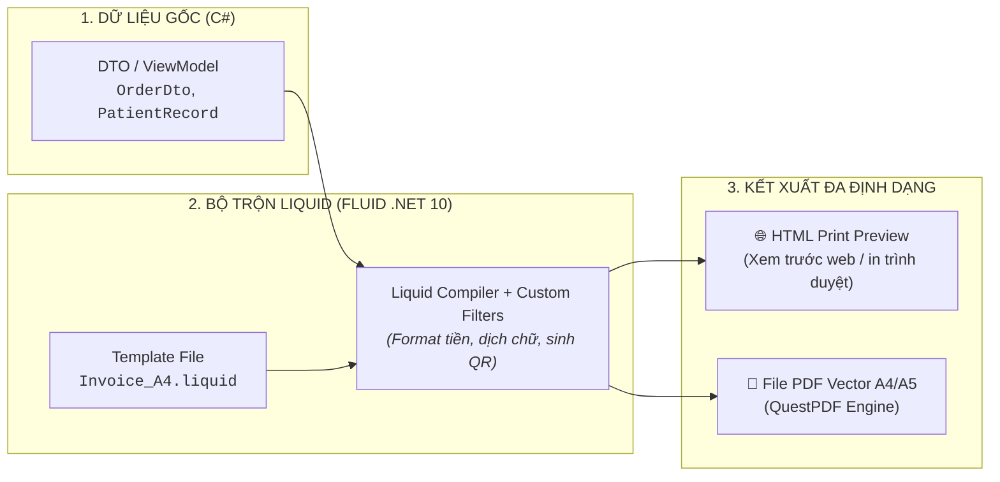

# 📘 HƯỚNG DẪN THIẾT KẾ & LẬP TRÌNH BÁO CÁO VỚI LIQUID ENGINE TỪ A ĐẾN Z
### (The Definitive Guide to Liquid Template Reporting in EDAP Framework)

> **Tài liệu dành cho:** Lập trình viên Backend, Frontend Designer, Chuyên viên Triển khai và Quản trị viên Hệ thống.  
> **Áp dụng cho:** Enterprise Distributed Application Platform (EDAP Core Engine).  
> **Ngôn ngữ mẫu:** Liquid Template Language (Chuẩn Shopify / Microsoft Power Pages / Fluid .NET 10).

---

## MỤC LỤC
1. [Tổng Quan & Nguyên Lý Hoạt Động](#1-tổng-quan--nguyên-lý-hoạt-động)
2. [Cú Pháp Liquid Cốt Lõi (Cheatsheet Từ A đến Z)](#2-cú-pháp-liquid-cốt-lõi-cheatsheet-từ-a-đến-z)
3. [Các Bộ Lọc Mở Rộng (Custom Filters) Có Sẵn Trong Framework](#3-các-bộ-lọc-mở-rộng-custom-filters-có-sẵn-trong-framework)
4. [Kỹ Thuật CSS In Ấn Chuyên Nghiệp (Paged Media & Print Layouts)](#4-kỹ-thuật-css-in-ấn-chuyên-nghiệp-paged-media--print-layouts)
5. [Nhúng JavaScript Tương Tác Trong Template](#5-nhúng-javascript-tương-tác-trong-template)
6. [Quy Trình 4 Bước Tạo Một Báo Cáo Mới](#6-quy-trình-4-bước-tạo-một-báo-cáo-mới)
7. [Các Mẫu Báo Cáo Doanh Nghiệp Thực Chiến](#7-các-mẫu-báo-cáo-doanh-nghiệp-thực-chiến)

---

## 1. TỔNG QUAN & NGUYÊN LÝ HOẠT ĐỘNG

Trong hệ thống EDAP, toàn bộ tài liệu in ấn (**Hóa đơn, Bệnh án, Đơn thuốc, Phiếu kho, Báo cáo thống kê**) được thiết kế dưới dạng **file HTML nhúng cú pháp Liquid (`.liquid` hoặc `.html`)**.



---

## 2. CÚ PHÁP LIQUID CỐT LÕI (CHEATSHEET TỪ A ĐẾN Z)

Liquid có 3 loại cú pháp chính:
- **`{{ ... }}` (Output):** In dữ liệu ra màn hình.
- **`` (Tags):** Xử lý logic (vòng lặp, rẽ nhánh, gán biến).
- **`{{ ... | filter }}` (Filters):** Biến đổi và định dạng dữ liệu.

---

### A. In Biến & Thuộc Tính Đối Tượng (Output)
```liquid
<!-- Truy xuất thuộc tính đơn -->
<p>Khách hàng: {{ CustomerName }}</p>
<p>Mã đơn hàng: #{{ OrderNumber }}</p>

<!-- Truy xuất thuộc tính lồng nhau (Nested Objects) -->
<p>Người tạo: {{ Creator.FullName }}</p>
<p>Phòng ban: {{ Department.Name }}</p>

<!-- Giá trị mặc định nếu biến bị null hoặc rỗng (Filter default) -->
<p>Ghi chú: {{ Note | default: 'Không có ghi chú' }}</p>
```

---

### B. Rẽ Nhánh Điều Kiện (`if / elsif / else / unless`)
```liquid
<!-- Câu lệnh if / else cơ bản -->

    <span class="badge-success">Đã hoàn thành</span>

    <span class="badge-danger">Đã hủy bỏ</span>

    <span class="badge-warning">Đang xử lý</span>


<!-- Phép so sánh nhiều điều kiện (and / or) -->

    <p class="discount-label">Được chiết khấu 10% cho khách VIP</p>


<!-- unless: Thực thi khi điều kiện SAI (Ngược lại với if) -->

    <p>Bản ghi hợp lệ</p>

```

---

### C. Vòng Lặp Duyệt Danh Sách (`for loop`)
```liquid
<table>
    <thead>
        <tr>
            <th>STT</th>
            <th>Tên Hàng Hóa</th>
            <th>Số Lượng</th>
            <th>Đơn Giá</th>
            <th>Thành Tiền</th>
        </tr>
    </thead>
    <tbody>
        
        <tr>
            <!-- forloop.index: STT bắt đầu từ 1 (forloop.index0 bắt đầu từ 0) -->
            <td class="text-center">{{ forloop.index }}</td>
            <td>
                <strong>{{ item.ProductName }}</strong>
                <!-- forloop.first / forloop.last: Kiểm tra dòng đầu / dòng cuối -->
                 <span class="tag-hot">Sản phẩm chính</span> 
            </td>
            <td class="text-center">{{ item.Quantity }}</td>
            <td class="text-right">{{ item.UnitPrice | format_currency: 'USD' }}</td>
            <td class="text-right">{{ item.Total | format_currency: 'USD' }}</td>
        </tr>
        
        <!-- Hiển thị khi danh sách Items rỗng -->
        <tr>
            <td colspan="5" class="text-center">Không có dữ liệu mặt hàng.</td>
        </tr>
        
    </tbody>
</table>
```

---

### D. Gán Biến & Phép Tính Toán Học (Math Filters)
Liquid cung cấp đầy đủ các toán tử `plus (+)` , `minus (-)` , `times (*)` , `divided_by (/)` , `modulo (%)` , `round`:

```liquid
<!-- Gán giá trị cho biến mới bằng thẻ assign -->



<!-- Phép nhân tính tiền VAT: TotalAmount * 0.1 -->


<!-- Phép cộng tính tổng thanh toán: TotalAmount + vat_amount -->


<!-- Tính tổng dồn (Running Sum) qua vòng lặp -->


    


<p>Tổng số lượng sản phẩm: <b>{{ total_qty }}</b></p>
<p>Tổng tiền sau thuế: <b>{{ grand_total | format_currency: 'USD' }}</b></p>
```

---

### E. Gom Nhóm Dữ Liệu Đa Cấp (Group By & Subtotal)
```liquid
<!-- Gom nhóm danh sách thuốc/vật tư theo Khoa/Phòng hoặc Nhóm danh mục -->



    <tr class="group-header">
        <td colspan="4"><strong>NHÓM: {{ group.Key | upcase }}</strong></td>
    </tr>

    
    
        
        <tr>
            <td>{{ item.ProductName }}</td>
            <td>{{ item.Quantity }}</td>
            <td>{{ item.UnitPrice | format_currency: 'VND' }}</td>
            <td>{{ item.Total | format_currency: 'VND' }}</td>
        </tr>
    

    <!-- In dòng tổng phụ (Subtotal) của từng nhóm -->
    <tr class="subtotal-row">
        <td colspan="3" class="text-right"><strong>Tổng nhóm {{ group.Key }}:</strong></td>
        <td><strong>{{ subtotal | format_currency: 'VND' }}</strong></td>
    </tr>

```

---

## 3. CÁC BỘ LỌC MỞ RỘNG (CUSTOM FILTERS) CÓ SẴN TRONG FRAMEWORK

Framework EDAP đã đăng ký sẵn **4 bộ lọc chuyên dụng cho thị trường Việt Nam & Doanh nghiệp**:

| Bộ Lọc (Filter) | Cú pháp sử dụng | Dữ liệu đầu vào | Kết quả đầu ra |
| :--- | :--- | :--- | :--- |
| **1. Định dạng tiền tệ** | `{{ val \| format_currency: 'VND' }}`<br/>`{{ val \| format_currency: 'USD' }}` | `1250000`<br/>`85.5` | `1.250.000 đ`<br/>`$85.50` |
| **2. Định dạng ngày tháng** | `{{ val \| format_date: 'dd/MM/yyyy' }}`<br/>`{{ val \| format_date: 'dd/MM/yyyy HH:mm' }}` | `2026-08-20T10:30:00Z` | `20/08/2026`<br/>`20/08/2026 10:30` |
| **3. Dịch số thành chữ tiếng Việt** | `{{ val \| to_vietnamese_words: 'đồng' }}`<br/>`{{ val \| to_vietnamese_words: 'đô la Mỹ' }}` | `101500` | *Một trăm lẻ một nghìn năm trăm đô la Mỹ chẵn.* |
| **4. Sinh mã QR Code Base64** | `{{ text \| qr_code }}` | `ORD-2026-001` | Trả về chuỗi `data:image/png;base64,iVBORw0...` gắn thẳng vào ``. |

---

## 4. KỸ THUẬT CSS IN ẤN CHUYÊN NGHIỆP (PAGED MEDIA & PRINT LAYOUTS)

Để trang in không bị lỗi tràn lề, rách bảng khi sang trang, hãy áp dụng bộ CSS chuẩn sau:

```css
/* 1. Khai báo khổ giấy chuẩn in ấn */
@page {
    size: A4 portrait; /* Hoặc: A5 landscape, 80mm auto cho bill nhiệt */
    margin: 12mm 15mm 15mm 15mm; /* Top Right Bottom Left */
}

/* 2. Ẩn các nút bấm trên Web khi in ra giấy hoặc PDF */
@media print {
    .no-print {
        display: none !important;
    }
    body {
        background: none !important;
        padding: 0 !important;
    }
}

/* 3. Chống rách dòng bảng khi chuyển trang (Bắt buộc) */
tr {
    page-break-inside: avoid;
}

/* 4. Lặp lại tiêu đề cột (thead) ở mỗi trang in mới */
thead {
    display: table-header-group;
}

/* 5. Ép ngắt trang chủ động */
.page-break {
    page-break-before: always;
}

/* 6. Dấu mộc Watermark chìm (ĐÃ THANH TOÁN / BẢN NHÁP) */
.watermark {
    position: absolute;
    top: 50%;
    left: 50%;
    transform: translate(-50%, -50%) rotate(-30deg);
    font-size: 60px;
    font-weight: 900;
    color: rgba(40, 167, 69, 0.12);
    text-transform: uppercase;
    border: 4px dashed rgba(40, 167, 69, 0.18);
    padding: 10px 40px;
    border-radius: 8px;
    pointer-events: none;
}
```

---

## 5. NHÚNG JAVASCRIPT TƯƠNG TÁC TRONG TEMPLATE

Bạn có thể viết mã JavaScript trực tiếp để tăng tính tương tác trên giao diện Web Preview:

```html
<!-- Nút in phiếu nhanh -->
<button class="no-print" onclick="window.print()">🖨️ In Phiếu Ngay</button>

<script>
    // 1. Nhận giá trị từ Liquid vào biến JavaScript
    const orderStatus = "{{ Status }}";
    const totalAmount = {{ TotalAmount }};
    const orderId = "{{ Id }}";

    // 2. Logic tương tác phía Client
    if (orderStatus.toLowerCase() === "cancelled") {
        const watermark = document.getElementById("watermarkStamp");
        watermark.innerText = "ĐÃ HỦY BỎ";
        watermark.style.color = "rgba(220, 38, 38, 0.15)";
    }

    // 3. Tự động mở hộp thoại in nếu URL có tham số ?autoprint=true
    const urlParams = new URLSearchParams(window.location.search);
    if (urlParams.get('autoprint') === 'true') {
        window.addEventListener('load', () => window.print());
    }
</script>
```

---

## 6. QUY TRÌNH 4 BƯỚC TẠO MỘT BÁO CÁO MỚI

### Bước 1: Khai báo Model Dữ Liệu (C# DTO)
```csharp
public record PrescriptionReportDto(
    string PrescriptionCode,
    string PatientName,
    int PatientAge,
    string Diagnosis,
    string DoctorName,
    DateTime CreatedAt,
    List<PrescriptionMedicineDto> Medicines
);
```

### Bước 2: Tạo File Template Liquid
Tạo file `Infrastructure/Reporting/Templates/Prescription_A4.liquid`:
```html
<!DOCTYPE html>
<html>
<head>
    <meta charset="UTF-8">
    <title>Đơn Thuốc - #{{ PrescriptionCode }}</title>
</head>
<body>
    <h2>BỆNH VIỆN ĐA KHOA QUỐC TẾ</h2>
    <h1>ĐƠN THUỐC ĐIỀU TRỊ</h1>
    
    <p>Bệnh nhân: <strong>{{ PatientName }}</strong> ({{ PatientAge }} tuổi)</p>
    <p>Chẩn đoán: {{ Diagnosis }}</p>

    <table>
        <thead>
            <tr><th>STT</th><th>Tên Thuốc</th><th>Số Lượng</th><th>Cách Dùng</th></tr>
        </thead>
        <tbody>
            
            <tr>
                <td>{{ forloop.index }}</td>
                <td><strong>{{ med.Name }}</strong></td>
                <td>{{ med.Quantity }} {{ med.Unit }}</td>
                <td><i>{{ med.UsageInstruction }}</i></td>
            </tr>
            
        </tbody>
    </table>
    
    <p>Bác sĩ điều trị: <strong>{{ DoctorName }}</strong></p>
</body>
</html>
```

### Bước 3: Gọi Render từ Controller
```csharp
[HttpGet("prescriptions/{id:guid}/print")]
[HasPermission("Reports", "Export")]
public async Task<IActionResult> PrintPrescription(Guid id, [FromQuery] ReportOutputFormat format = ReportOutputFormat.Pdf)
{
    var prescriptionDto = await _bus.InvokeAsync<PrescriptionReportDto>(new GetPrescriptionQuery(id));

    var request = new ReportRenderRequest(
        TemplateCode: "Prescription_A4",
        DataModel: prescriptionDto,
        Format: format
    );

    var result = await _reportEngine.RenderAsync(request);
    return File(result.Content, result.ContentType, result.FileName);
}
```

### Bước 4: Tùy Biến Mẫu Riêng Cho Từng Đơn Vị (Tenant Overrides)
Nếu **Bệnh Viện Bạch Mai** muốn dùng mẫu riêng có Logo riêng:
- Chỉ cần lưu file template vào: `Infrastructure/Reporting/Templates/hospital-bachmai/Prescription_A4.liquid`.
- Hệ thống sẽ **tự động ưu tiên nạp mẫu của Bạch Mai** khi đơn vị này in ấn, các đơn vị khác vẫn dùng mẫu chuẩn chung của hệ thống!

---

## 7. CÁC MẪU BÁO CÁO DOANH NGHIỆP THỰC CHIẾN

File mẫu in chuẩn mực đã được xây dựng sẵn trong dự án:
- [`Infrastructure/Reporting/Templates/Invoice_A4.liquid`](file:///d:/Github/wolverine/WolverineApp/Infrastructure/Reporting/Templates/Invoice_A4.liquid): Mẫu hóa đơn bán hàng & phiếu xuất kho A4 hoàn chỉnh kèm mã QR Code, tiền bằng chữ tiếng Việt và chữ ký 3 bên.

---

### 🌐 TỔNG KẾT
Với Liquid Template Engine, hệ thống EDAP cung cấp một giải pháp làm báo cáo **Gọn nhẹ - An toàn - Tốc độ cao - Dễ bảo trì và Tùy biến linh hoạt theo từng khách hàng**.
