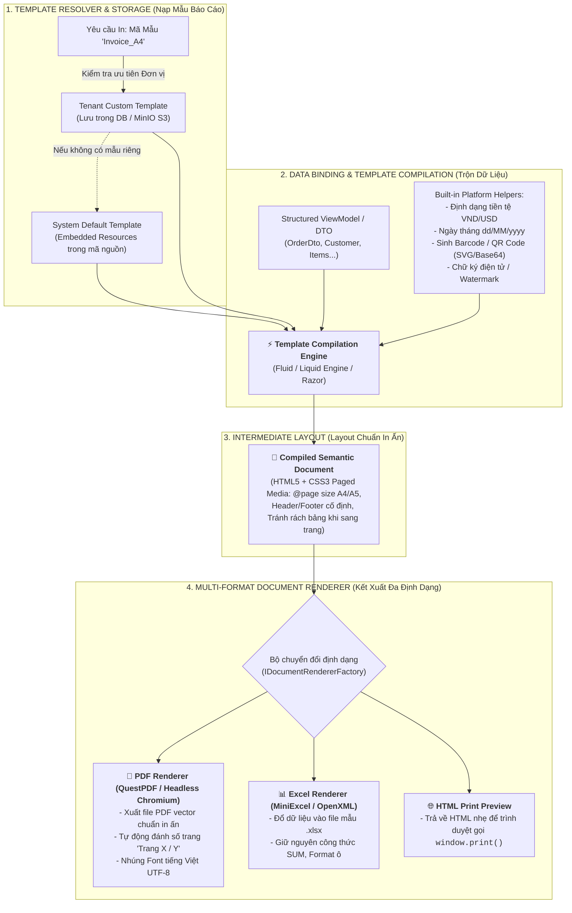
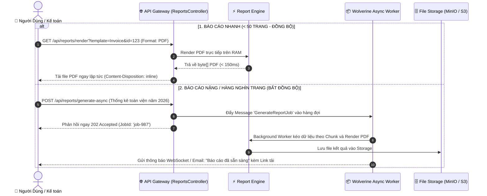

# BÁO CÁO THIẾT KẾ KIẾN TRÚC ĐỘNG CƠ BÁO CÁO & KẾT XUẤT TÀI LIỆU NỀN TẢNG
## (ENTERPRISE TEMPLATE-DRIVEN REPORTING & DOCUMENT RENDERING ENGINE)

> **Dự án:** Enterprise Distributed Application Platform (EDAP)  
> **Phân hệ cốt lõi:** Core Reporting & Document Rendering Engine  
> **Phiên bản thiết kế:** 1.0 (Production Blueprint)  
> **Mục tiêu:** Cung cấp hạ tầng nền tảng hoàn chỉnh để nạp mẫu báo cáo (Template), trộn dữ liệu (Data Binding), và kết xuất ra PDF (chuẩn in ấn A4/A5), Excel (.xlsx), Word (.docx) và HTML Print Preview cho mọi module nghiệp vụ (Bệnh viện HIS, ERP, Kho vận, Bán hàng, Tài chính).

---

## I. TỔNG QUAN KIẾN TRÚC ĐỘNG CƠ BÁO CÁO NỀN TẢNG

Trong các hệ thống doanh nghiệp (đặc biệt là Bệnh viện, ERP, Hóa đơn điện tử), việc in ấn tài liệu (**Bệnh án, Đơn thuốc, Hóa đơn GTGT, Phiếu xuất kho, Báo cáo tài chính**) là hạ tầng dùng chung không thể thiếu.

Nền tảng EDAP xây dựng **Pipeline Kết Xuất Tài Liệu 4 Giai Đoạn (4-Stage Document Rendering Pipeline)**:



---

## II. CHI TIẾT 3 KHỐI NỀN TẢNG CỐT LÕI

### 1. 🗄️ Khối Nạp & Quản Lý Template Đa Thuê Bao (`IReportTemplateStore`)
Mỗi đơn vị (Tenant) có thể có mẫu in riêng (Logo riêng, tiêu ngữ bệnh viện riêng, mẫu phiếu riêng), trong khi hệ thống luôn có mẫu mặc định:

- **Mẫu mặc định hệ thống (System Default):** Được đóng gói dưới dạng Embedded Resources (`.liquid` hoặc `.html`) trong DLL.
- **Mẫu tùy biến theo Đơn vị (Tenant Overrides):** Được lưu trong Database hoặc MinIO S3 theo cấu trúc `templates/{tenantId}/{templateCode}.liquid`.
- **Cơ chế Fallback thông minh:** Nếu đơn vị chưa tùy biến $\rightarrow$ Tự động dùng mẫu chuẩn của hệ thống.

```csharp
public interface IReportTemplateStore
{
    Task<string> GetTemplateContentAsync(string templateCode, string tenantId, CancellationToken cancellationToken = default);
    Task SaveCustomTemplateAsync(string templateCode, string tenantId, string content, CancellationToken cancellationToken = default);
}
```

---

### 2. ⚡ Khối Trộn Dữ Liệu & Tiện Ích In Ấn (`IReportEngine`)
Khối này nhận Template và ViewModel nghiệp vụ để sinh ra tài liệu hoàn chỉnh.

**Tích hợp sẵn các Helper nền tảng mà mọi báo cáo đều cần:**
1. **Định dạng số và tiền tệ:** `{{ item.UnitPrice | format_currency: 'VND' }}` $\rightarrow$ `1.200.000 đ`.
2. **Định dạng thời gian:** `{{ order.CreatedAt | format_date: 'dd/MM/yyyy HH:mm' }}` $\rightarrow$ `20/08/2026 14:30`.
3. **Chuyển số thành chữ tiếng Việt:** `{{ order.TotalAmount | to_vietnamese_words }}` $\rightarrow$ *"Một triệu hai trăm nghìn đồng chẵn"*.
4. **Sinh Mã vạch & QR Code tự động:**
   `{{ order.OrderNumber | generate_barcode: 'Code128' }}` $\rightarrow$ Trả về ảnh Base64/SVG nhúng thẳng vào trang in.
5. **Đánh số trang & Ngắt trang thông minh (CSS Paged Media):**
   - `@page { size: A4 portrait; margin: 15mm; }`
   - `tr { page-break-inside: avoid; }` (Chống rách dòng bảng khi chuyển trang).

---

### 3. 📑 Khối Kết Xuất Đa Định Dạng: PDF, Excel, HTML (`IDocumentRenderer`)

```csharp
public enum ReportOutputFormat
{
    Pdf,        // File PDF vector chuẩn in ấn
    Excel,      // File bảng tính Excel (.xlsx)
    Word,       // File văn bản (.docx)
    Html        // Xem trước trực tiếp trên Web / In qua Trình duyệt
}

public record ReportRenderRequest(
    string TemplateCode,
    object DataModel,
    ReportOutputFormat Format = ReportOutputFormat.Pdf,
    Dictionary<string, object>? Parameters = null
);

public record ReportRenderResult(
    byte[] Content,
    string ContentType,
    string FileName
);

public interface IReportEngine
{
    Task<ReportRenderResult> RenderAsync(ReportRenderRequest request, CancellationToken cancellationToken = default);
}
```

#### Công nghệ Kết xuất PDF được lựa chọn:
1. **QuestPDF (Native C# Fluent PDF Engine):** Tốc độ siêu nhanh (> 1.000 trang/giây), tốn cực ít RAM, không phụ thuộc trình duyệt ngoài, hỗ trợ bảng biểu phức tạp và đánh số trang chuẩn xác.
2. **PuppeteerSharp / Playwright (Chromium Headless Renderer):** Chuyển đổi chính xác 100% từ giao diện HTML/CSS sang PDF, hỗ trợ biểu đồ phức tạp và CSS Grid/Flexbox.

---

## III. THIẾT KẾ CƠ CHẾ CHỊU TẢI (SYNC VS ASYNC REPORTING)

Để không làm nghẽn Server khi in các báo cáo lớn (như Sổ tổng hợp bệnh án 10.000 trang hay Báo cáo doanh thu cả năm):



---

## IV. LỘ TRÌNH TÍCH HỢP VÀO CODEBASE HIỆN TẠI

Để hoàn thiện Động cơ Báo cáo Nền tảng này, các thành phần sẽ được tổ chức trong thư mục:

```text
WolverineApp/
├── Application/
│   └── Common/
│       └── Reporting/             # [CORE INTERFACES]
│           ├── IReportEngine.cs
│           ├── IReportTemplateStore.cs
│           ├── IDocumentRenderer.cs
│           └── Models/ (ReportRenderRequest, ReportRenderResult, ReportOutputFormat)
│
├── Infrastructure/
│   └── Reporting/                # [HẠ TẦNG HIỆN THỰC HÓA]
│       ├── TemplateStores/       # FileSystemTemplateStore & DbTemplateStore
│       ├── TemplateEngines/      # LiquidTemplateEngine (Fluid) với Custom Filters
│       ├── Renderers/            # PdfDocumentRenderer, ExcelDocumentRenderer, HtmlRenderer
│       ├── Helpers/              # VietnameseNumberToWordsHelper, BarcodeQrHelper
│       └── Templates/            # Thư mục chứa các mẫu chuẩn (.liquid, .html)
│           ├── Orders/           # Mẫu Hóa đơn đơn hàng (Invoice_A4.liquid)
│           └── Common/           # Header, Footer, CSS chung
│
└── Controllers/
    └── ReportsController.cs      # API nền tảng: /api/reports/render, /api/reports/templates
```

---

## V. KẾT LUẬN & ĐÁNH GIÁ

Với thiết kế này:
1. **Tính độc lập nghiệp vụ 100%:** Bất kỳ module nào sau này (Bệnh viện, Bán hàng, Kho) chỉ cần ném DTO vào `_reportEngine.RenderAsync(...)` là có ngay file PDF/Excel in ấn sắc nét.
2. **Tùy biến đa đơn vị (Multi-Tenant):** Mỗi khách hàng/bệnh viện có thể tự sửa mẫu in theo ý muốn mà không cần sửa code C#.
3. **Hiệu năng cao:** Không bị tràn RAM khi in tài liệu lớn nhờ cơ chế Streaming và Background Worker.
