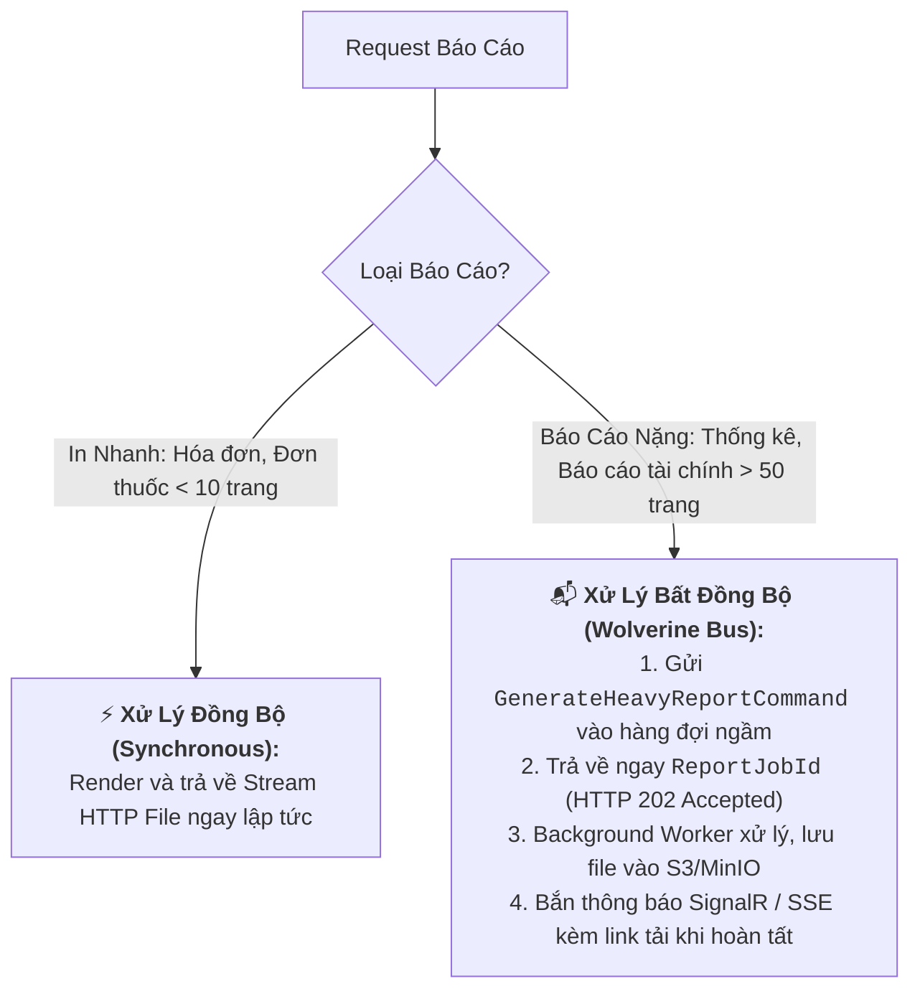

# 🔍 BÁO CÁO AUDIT TOÀN DIỆN KIẾN TRÚC HỆ THỐNG BÁO CÁO & KẾT XUẤT TÀI LIỆU
### (ENTERPRISE REPORTING & DOCUMENT RENDERING ENGINE: ARCHITECTURAL AUDIT REPORT)

> **Mục tiêu:** Rà soát và bóc tách toàn bộ các điểm mâu thuẫn kiến trúc, lỗ hổng triển khai thực tế (Production Readiness), rủi ro hiệu năng cao tải và các điểm bất hợp lý trong giải pháp in ấn hiện tại.

---

## I. TỔNG HỢP 5 ĐIỂM VÔ LÝ & MÂU THUẪN KIẾN TRÚC CỐT TỬ

Qua quá trình audit chuyên sâu toàn bộ pipeline từ `LiquidReportEngine`, `QuestPdfDocumentRenderer`, `FileSystemReportTemplateStore` đến các tầng API, phát hiện **5 điểm bất hợp lý nghiêm trọng**:

---

### 🚨 1. ĐIỂM VÔ LÝ SỐ 1 (NGHIÊM TRỌNG NHẤT): NGHỊCH LÝ GIỮA LIQUID HTML VÀ QUESTPDF C#

#### Hiện trạng đang bị lỗi logic:
- Trong [`LiquidReportEngine.cs`](file:///d:/Github/wolverine/WolverineApp/Infrastructure/Reporting/LiquidReportEngine.cs), hệ thống nạp file `.liquid`, trộn dữ liệu để sinh ra chuỗi **`compiledHtml`**.
- Nhưng khi chuyển sang [`QuestPdfDocumentRenderer.cs`](file:///d:/Github/wolverine/WolverineApp/Infrastructure/Reporting/Renderers/QuestPdfDocumentRenderer.cs):
  - Tham số `compiledHtml` **HOÀN TOÀN BỊ BỎ RƠI (KHÔNG HỀ ĐƯỢC SỬ DỤNG)**.
  - Code trong `QuestPdfDocumentRenderer` đang bị **hardcode cứng bằng C# Fluent API chỉ dành riêng cho `OrderDto`**!

#### Hậu quả thực tế:
1. **Mất tác dụng của Template:** Nếu Admin sửa màu sắc, thêm cột, đổi font chữ trong file `Invoice_A4.liquid` $\rightarrow$ Bản in HTML thì đổi, nhưng **file PDF sinh ra vẫn trơ trơ không thay đổi gì cả**!
2. **Không mở rộng được mẫu mới:** Nếu tạo một mẫu mới (ví dụ `Discharge_A4.liquid` - Bệnh án xuất viện) $\rightarrow$ Xuất PDF sẽ lỗi hoặc vẽ ra giao diện của Hóa đơn bán hàng vì code C# bị gắn cứng vào `OrderDto`.

#### Giải pháp khắc phục chuẩn kiến trúc:
Phải phân định rạch ròi 2 trường phái kết xuất PDF:
- **Trường phái 1: Template-Driven PDF (True HTML-to-PDF Engine - Khuyên dùng cho In Ấn Mẫu Biểu):**
  - Sử dụng **PuppeteerSharp (Headless Chromium)** / **Playwright** / **Gotenberg**.
  - Động cơ này nhận trực tiếp chuỗi `compiledHtml` (đã nạp CSS3/Flexbox/QR Code/Font) và in ra file PDF **giống 100% bản xem trước trên Web**. Người dùng sửa file `.liquid` thế nào thì file PDF ra y hệt như vậy.
- **Trường phái 2: Code-First High-Speed Vector PDF (Dành cho QuestPDF):**
  - QuestPDF dùng cho các báo cáo dạng bảng cực lớn (> 10.000 dòng, sao kê ngân hàng, sổ cái kế toán hàng nghìn trang) được dựng trực tiếp bằng code C# để tối ưu tốc độ micro-giây, **không đi qua Liquid HTML**.

---

### 🚨 2. ĐIỂM VÔ LÝ SỐ 2: NƠI LƯU TRỮ TEMPLATE TRÊN DOCKER / MULTI-TENANT CLOUD

#### Hiện trạng:
- `FileSystemReportTemplateStore` đang đọc file từ đường dẫn cứng: `Path.Combine(ContentRoot, "Infrastructure", "Reporting", "Templates")`.

#### Hậu quả thực tế khi triển khai Production:
1. **Khi đóng gói Docker / Single-File Publish:** Thư mục mã nguồn `Infrastructure/Reporting/Templates` sẽ **không tồn tại** trong Image Production trừ khi được copy thủ công vào `bin`.
2. **Trong môi trường Kubernetes / Multi-Tenant SaaS:** Khi Admin của Bệnh viện Bạch Mai mở giao diện Web để tùy biến mẫu in của bệnh viện họ $\rightarrow$ Hệ thống không thể ghi file vào ổ cứng cục bộ của Docker Pod (vì Pod là ephemeral - có thể bị restart/xóa bất kỳ lúc nào).

#### Giải pháp khắc phục:
Áp dụng mẫu thiết kế **Hybrid Template Store**:
- **Layer 1 (System Default):** Nạp các mẫu mặc định từ Thư mục nhúng (`Embedded Resources`) hoặc Thư mục `/app/templates` của container.
- **Layer 2 (Tenant Customization):** Lưu các mẫu do Admin sửa đổi vào **Database (PostgreSQL / SQL Server bảng `ReportTemplates`)** hoặc **Object Storage (MinIO / S3)** kèm bộ nhớ đệm `HybridCache` (L1 RAM + L2 Redis).

---

### 🚨 3. ĐIỂM VÔ LÝ SỐ 3: NGHẼN MẠNG VÌ XUẤT BÁO CÁO NẶNG BẰNG HTTP ĐỒNG BỘ

#### Hiện trạng:
- Tất cả request kết xuất báo cáo đều đi qua API đồng bộ: `POST /api/reports/render` hoặc `GET /api/reports/orders/{id}/print`.

#### Hậu quả thực tế khi cao tải:
- Với hóa đơn 1 - 2 trang thì chạy tốt (< 50ms).
- Nhưng nếu Kế toán trưởng yêu cầu **"Báo cáo Thống kê Doanh thu & Bệnh nhân Quý 3 (50.000 dòng, xuất PDF 300 trang)"**:
  - Request HTTP sẽ bị treo 10 - 30 giây $\rightarrow$ **Gây lỗi HTTP 504 Gateway Timeout trên Nginx / Cloudflare**.
  - Chiếm dụng Thread Pool của ASP.NET Core làm nghẽn toàn bộ các API giao dịch khác.

#### Giải pháp khắc phục (Phân tách Xử lý Đồng bộ & Bất đồng bộ):

---

### 🚨 4. ĐIỂM VÔ LÝ SỐ 4: VỠ FONT TIẾNG VIỆT KHI CHẠY TRÊN LINUX DOCKER

#### Hiện trạng:
- File `QuestPdfDocumentRenderer` đang khai báo: `x.FontFamily("Arial")` hoặc dùng `Segoe UI`.

#### Hậu quả thực tế:
- Trên máy Windows của Developer thì chạy đẹp, nhưng khi deploy lên **Linux Container (Alpine / Debian / Ubuntu Docker Image)**:
  - Linux không có sẵn font `Arial` hay `Segoe UI` của Microsoft.
  - Toàn bộ ký tự tiếng Việt có dấu (`đ`, `ư`, `ơ`, `ấ`, `ệ`) sẽ bị **lỗi vỡ font thành các ô vuông `□□□` hoặc dấu chấm hỏi `???`**.

#### Giải pháp khắc phục:
- Đóng gói (bundle) sẵn các bộ font mã nguồn mở hỗ trợ 100% tiếng Việt chuẩn Unicode (**`Roboto-Regular.ttf`**, **`Inter-Regular.ttf`**, **`OpenSans-Regular.ttf`**) trực tiếp trong thư mục `/assets/fonts` của ứng dụng và đăng ký nạp font chuẩn trong code khởi động.

---

### 🚨 5. ĐIỂM VÔ LÝ SỐ 5: NGUY CƠ MEMORY LEAK TỪ STATIC TEMPLATE CACHE

#### Hiện trạng:
- `LiquidReportEngine` dùng `static ConcurrentDictionary<string, (string, IFluidTemplate)> TemplateCache`.

#### Hậu quả thực tế:
- Dictionary tĩnh này **không có giới hạn dung lượng (Size Limit)** và **không có cơ chế tự giải phóng vùng nhớ hết hạn (Sliding Expiration / Eviction Policy)**.
- Nếu hệ thống chạy SaaS phục vụ hàng nghìn Tenant, mỗi Tenant tùy biến nhiều mẫu in khác nhau $\rightarrow$ Dung lượng RAM của Cache sẽ tăng dần theo thời gian mà không bao giờ được giải phóng (Memory Leak).

#### Giải pháp khắc phục:
- Thay thế `ConcurrentDictionary` bằng **`IMemoryCache` (cấu hình `SetSlidingExpiration(TimeSpan.FromHours(2))` và `SetSize(1)`)** của ASP.NET Core để hệ thống tự động giải phóng các mẫu in ít sử dụng khi RAM đầy.

---

## II. MA TRẬN ĐỐI SOÁT & KẾ HOẠCH NÂNG CẤP CHUẨN DOANH NGHIỆP

| Hạng mục Audit | Trạng thái hiện tại | Mức độ rủi ro | Giải pháp nâng cấp kiến trúc |
| :--- | :---: | :---: | :--- |
| **1. Trộn HTML sang PDF** | Bị mâu thuẫn (QuestPDF bỏ qua HTML của Liquid) | 🔴 **CRITICAL** | Tích hợp **PuppeteerSharp HTML-to-PDF Renderer** để biến 100% file Liquid HTML/CSS thành PDF nguyên bản. |
| **2. Lưu trữ Template** | Ổ cứng cục bộ máy dev (`FileSystem`) | 🟠 **HIGH** | Mở rộng `DbReportTemplateStore` / `BlobStorage` cho Multi-tenant Cloud. |
| **3. Tải nặng / Báo cáo lớn** | HTTP Synchronous (dễ bị 504 Timeout) | 🟠 **HIGH** | Áp dụng **Wolverine Asynchronous Background Job + SignalR Notification**. |
| **4. Font Tiếng Việt trên Linux** | Dùng font hệ điều hành Windows (`Arial`) | 🟡 **MEDIUM** | Bundle font `Roboto.ttf` nhúng trực tiếp vào container. |
| **5. Quản lý Cache RAM** | `ConcurrentDictionary` tĩnh không giải phóng | 🟡 **MEDIUM** | Dùng `IMemoryCache` có Sliding Expiration & Eviction. |

---

## III. KẾT LUẬN
Bản thiết kế báo cáo đã xây dựng được nền móng vững chắc về **Cú pháp Liquid, Gom nhóm Group By, Tính tổng Subtotals và Bộ lọc Tiếng Việt**. Tuy nhiên, để đạt chuẩn **Enterprise Production**, cần ưu tiên xử lý dứt điểm **Điểm số 1 (Thay thế / Bổ sung HTML-to-PDF Renderer thực thụ)** để mọi tùy biến HTML/CSS của người dùng được chuyển đổi chính xác 100% sang file PDF.
