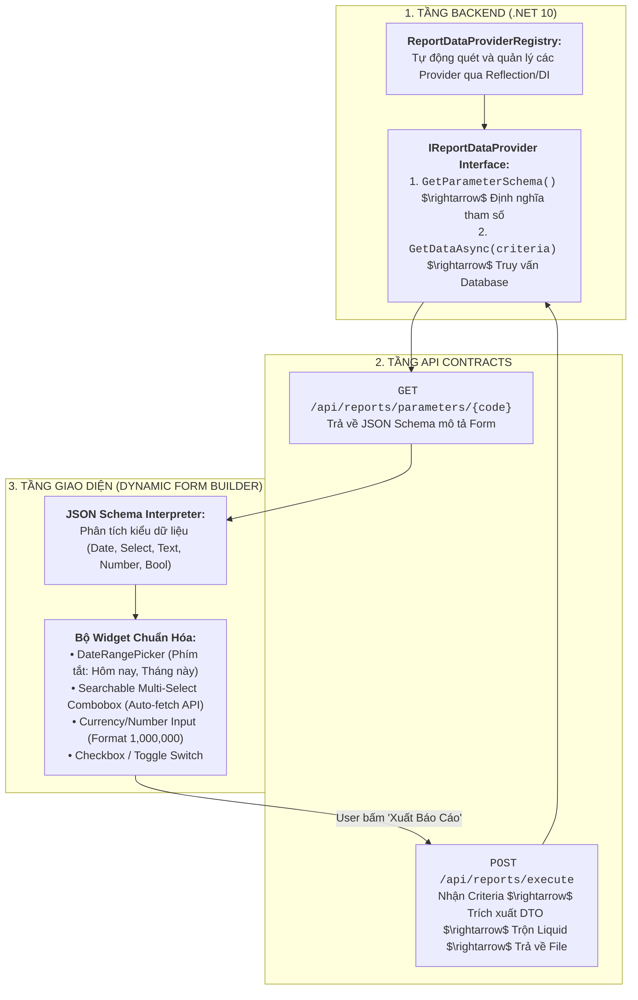

# 🏛️ ĐẶC TẢ THIẾT KẾ: HỆ THỐNG THAM SỐ BÁO CÁO ĐỘNG & TỰ ĐỘNG SINH GIAO DIỆN LỌC DỮ LIỆU
### (DYNAMIC REPORT PARAMETERS & METADATA-DRIVEN UI FORM GENERATION SPECIFICATION)

> **Mục tiêu:** Xây dựng nền tảng quản lý tham số lọc báo cáo động theo mô hình Metadata-Driven Architecture: Tách biệt hoàn toàn định nghĩa tham số (Parameter Schema), logic truy vấn dữ liệu (Data Provider) và giao diện người dùng (Frontend Dynamic Form Generator), cho phép mở rộng không giới hạn số lượng báo cáo mà không phải sửa đổi mã nguồn giao diện hay API Controller.

---

## I. TỔNG QUAN KIẾN TRÚC & PHÂN TÁCH TRÁCH NHIỆM



---

## II. ĐẶC TẢ CHI TIẾT CÁC THÀNH PHẦN KỸ THUẬT

### 1. Cấu Trúc JSON Parameter Schema Chuẩn Hóa
Định nghĩa metadata trả về cho Frontend dựng form:

```json
{
  "reportCode": "Revenue_By_Department",
  "reportName": "Báo cáo Doanh thu Tổng hợp theo Khoa / Phòng",
  "category": "Billing",
  "parameters": [
    {
      "name": "DateRange",
      "label": "Khoảng thời gian",
      "type": "date_range",
      "required": true,
      "defaultValue": "current_month",
      "order": 1
    },
    {
      "name": "DepartmentIds",
      "label": "Khoa / Phòng ban",
      "type": "multi_select",
      "required": false,
      "dataSource": "/api/master-data/departments",
      "valueField": "id",
      "labelField": "name",
      "placeholder": "Tất cả các khoa phòng",
      "order": 2
    },
    {
      "name": "PaymentStatus",
      "label": "Trạng thái thanh toán",
      "type": "select",
      "required": true,
      "options": [
        { "value": "ALL", "label": "Tất cả trạng thái" },
        { "value": "PAID", "label": "Đã thanh toán" },
        { "value": "PENDING", "label": "Chờ quyết toán" }
      ],
      "defaultValue": "ALL",
      "order": 3
    },
    {
      "name": "MinTotalAmount",
      "label": "Doanh thu tối thiểu (VNĐ)",
      "type": "currency",
      "required": false,
      "defaultValue": 0,
      "order": 4
    }
  ]
}
```

---

### 2. Thiết Kế Backend Interface (`IReportDataProvider`)

```csharp
namespace WolverineApp.Application.Common.Reporting;

public interface IReportDataProvider
{
    string ReportCode { get; }
    string ReportName { get; }
    string Category { get; }

    /// <summary>
    /// Định nghĩa cấu trúc các tham số đầu vào của báo cáo.
    /// </summary>
    ReportParameterSchema GetParameterSchema();

    /// <summary>
    /// Thực hiện truy vấn dữ liệu từ Database dựa trên bộ lọc người dùng gửi lên.
    /// </summary>
    Task<object> ExtractDataAsync(ReportFilterCriteria criteria, string tenantId, CancellationToken cancellationToken);
}
```

---

### 3. Trình Quản Lý & Tự Động Đăng Ký (Data Provider Registry)
- Sử dụng cơ chế Service Discovery tự động quét toàn bộ các class hiện thực `IReportDataProvider` trong Assembly khi ứng dụng khởi động.
- Khi một báo cáo mới được bổ sung vào hệ thống:
  - Lập trình viên chỉ cần tạo duy nhất 1 class kế thừa `IReportDataProvider`.
  - Hệ thống tự động nhận diện và cung cấp API lấy tham số cũng như thực thi báo cáo mà không cần cấu hình thủ công.

---

### 4. Thành Phần Giao Diện Phía Client (Dynamic Form Generator)
- Xây dựng Component độc lập: `<DynamicReportFilterForm schema={schema} onExecute={handleExport} />`.
- Tự động map `type` sang các Input Controller:
  - `date_range` $\rightarrow$ Component chọn dải ngày kèm preset (Hôm nay, 7 ngày qua, Tháng này, Quý này).
  - `select` / `multi_select` có `dataSource` $\rightarrow$ Tự động fetch API danh mục và hỗ trợ tìm kiếm phân trang.
  - `currency` $\rightarrow$ Tự động format tiền tệ theo chuẩn Việt Nam.
  - `boolean` $\rightarrow$ Switch Toggle.
- Tự động validate các ràng buộc `required`, `min`, `max` ngay tại Client trước khi gửi request về Backend.

---

## III. ĐẶC TẢ API CONTRACTS

### 1. Lấy Bản Mô Tả Tham Số Của Báo Cáo
- **Endpoint:** `GET /api/reports/parameters/{reportCode}`
- **Headers:** `Authorization: Bearer <token>`
- **Response:** `HTTP 200 OK` kèm `ReportParameterSchema`.

### 2. Thực Thi Xuất Báo Cáo Với Bộ Lọc Động
- **Endpoint:** `POST /api/reports/execute`
- **Request Body:**
```json
{
  "reportCode": "Revenue_By_Department",
  "format": 0, // 0: PDF, 1: HTML, 2: Excel, 3: CSV
  "criteria": {
    "FromDate": "2026-08-01",
    "ToDate": "2026-08-20",
    "DepartmentIds": ["KHOA_NGOAI", "KHOA_NOI"],
    "PaymentStatus": "PAID",
    "MinTotalAmount": 1000000
  }
}
```
- **Response:** Stream file kết xuất (`application/pdf`, `text/html`, hoặc `application/vnd.openxmlformats...`).

---

## IV. KẾ HOẠCH XÁC MINH (VERIFICATION PLAN)

1. **Kiểm tra Auto-Discovery:** Đăng ký 2 Data Provider mẫu (`Revenue_By_Department` và `Hospital_Discharge_Summary`) $\rightarrow$ Gọi `GET /api/reports/parameters` để xác nhận cả 2 schema đều được nhận diện chính xác.
2. **Kiểm tra Validation:** Gửi request thiếu tham số bắt buộc (`required: true`) $\rightarrow$ Xác nhận hệ thống trả về mã lỗi `400 Bad Request` kèm thông báo chi tiết.
3. **Kiểm tra Thực thi End-to-End:** Gửi request với bộ tham số đầy đủ $\rightarrow$ Xác nhận Data Provider query DB thành công, trộn dữ liệu vào Liquid template và xuất ra file PDF hoàn chỉnh.
