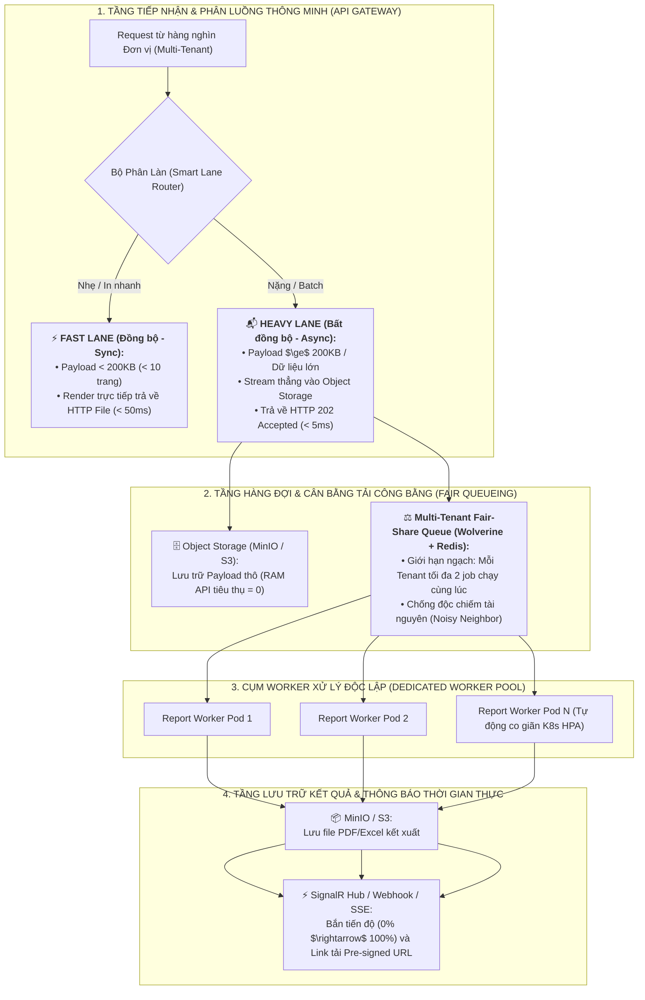

# 🏛️ ĐẶC TẢ THIẾT KẾ KIẾN TRÚC HỆ THỐNG XỬ LÝ BÁO CÁO & KẾT XUẤT TÀI LIỆU QUY MÔ LỚN
### (ENTERPRISE HIGH-SCALE & MULTI-TENANT DISTRIBUTED REPORTING ENGINE SPECIFICATION)

> **Mục tiêu:** Xây dựng kiến trúc xử lý tài liệu chuẩn cho Tập đoàn Công nghệ / Hệ thống Y tế & ERP Quốc gia: Chịu tải đồng thời từ hàng nghìn đơn vị (Multi-Tenant), xử lý an toàn các bộ dữ liệu lớn (10MB+ / 100.000 dòng), đảm bảo **Zero-OOM (Không bao giờ tràn RAM)**, **Zero-Timeout (Không treo API)** và **Chống nghẽn láng giềng (Noisy Neighbor Protection)**.

---

## I. TỔNG QUAN KIẾN TRÚC HỆ THỐNG (5 TRỤ CỘT CỐT LÕI)



---

## II. CHI TIẾT 5 TRỤ CỘT KỸ THUẬT

### 1. Phân Luồng Yêu Cầu Tự Động (Smart Dual-Lane Routing)
- **Fast Lane (`POST /api/reports/render`):**
  - Áp dụng cho: In đơn thuốc, Hóa đơn lẻ, Phiếu chỉ định, Biên lai thanh toán ($< 10$ trang, payload $< 200\text{ KB}$).
  - Xử lý đồng bộ, tận dụng RAM Cache `HybridCache` để trả về file nhị phân trong thời gian $< 50\text{ms}$.
- **Heavy Lane (`POST /api/reports/jobs`):**
  - Áp dụng cho: Báo cáo tài chính, Sổ cái doanh thu, Danh sách bệnh nhân nội trú cả tháng ($> 10\text{MB}$, $> 50.000$ dòng).
  - Tiếp nhận dưới dạng Stream, ghi thẳng lên Object Storage (MinIO / S3) mà không tạo C# Object Graph lớn trên Heap (tránh Garbage Collection Gen 2 pause).
  - Trả về ngay lập tức HTTP `202 Accepted` kèm `jobId` trong $< 5\text{ms}$.

---

### 2. Thuật Toán Hàng Đợi Đa Đơn Vị Công Bằng (Multi-Tenant Fair Queueing)
- **Vấn đề triệt tiêu:** Một bệnh viện lớn gửi 500 yêu cầu xuất báo cáo nặng không được phép làm nghẽn 999 phòng khám nhỏ khác.
- **Cơ chế triển khai:**
  - Áp dụng thuật toán **Distributed Leaky Bucket** trên Redis.
  - Mỗi `TenantId` có một hạn ngạch chạy song song (Concurrency Quota = 2 workers).
  - Khi Tenant A gửi 100 job: 2 job được xử lý ngay, 98 job còn lại nằm trong hàng đợi chờ của Tenant A.
  - Khi Tenant B gửi 1 job: Job của Tenant B được ưu tiên đưa vào luồng thực thi ngay lập tức mà không phải xếp sau 98 job của Tenant A.

---

### 3. Bộ Nhớ Đệm và Cơ Chế Stream Chunking (Zero-OOM Guarantee)
- **Cơ chế đọc tuần tự (Stream Processing):**
  - Worker không nạp toàn bộ 10MB JSON vào RAM cùng lúc.
  - Sử dụng `Utf8JsonStreamReader` kết hợp đọc từng mảng bản ghi (Chunk size: 1.000 dòng / batch).
  - Nạp dữ liệu vào template theo từng trang in A4 và đẩy trực tiếp ra `FileStream` lưu tạm trên SSD.
  - **Mức chiếm dụng RAM:** Duy trì ổn định $< 50\text{MB}$ cho mỗi Worker, bất kể file báo cáo nặng 10MB hay 100MB.

---

### 4. Cụm Worker Tách Biệt & Tự Động Co Giãn (Dedicated Worker Cluster)
- Máy chủ API Gateway (Core Web API) **hoàn toàn không thực hiện tác vụ render PDF/Excel**.
- Tác vụ nặng được điều phối qua **Wolverine Message Bus (`GenerateReportJobCommand`)** tới Cụm Worker Pods riêng biệt.
- **K8s HPA (Horizontal Pod Autoscaler):** Tự động scale từ 2 pods lên 20 pods khi số lượng job trong hàng đợi tăng cao trong các giờ cao điểm quyết toán.

---

### 5. Thông Báo Chủ Động Thời Gian Thực (SignalR & Pre-Signed URL)
- Giao diện người dùng (Frontend) kết nối tới `NotificationHub` qua WebSocket/SignalR.
- Worker phát đi các sự kiện tiến trình:
  - `JobStatusChanged`: `{ jobId: "...", status: "Processing", percent: 45 }`
  - `JobCompleted`: `{ jobId: "...", status: "Completed", downloadUrl: "https://minio.../export_2026.pdf", expiresAt: "..." }`
  - `JobFailed`: `{ jobId: "...", status: "Failed", errorMessage: "..." }`

---

## III. MÔ HÌNH DỮ LIỆU (DATABASE SCHEMA)

### Bảng `ReportJobs`
| Tên Cột | Kiểu Dữ Liệu | Ràng Buộc | Mô Tả |
| :--- | :--- | :--- | :--- |
| `Id` | `UUID` | Primary Key | Định danh duy nhất của Job |
| `TenantId` | `VARCHAR(50)` | Indexed | Đơn vị sở hữu báo cáo (Cách ly dữ liệu) |
| `UserId` | `VARCHAR(100)` | Indexed | Người tạo yêu cầu |
| `TemplateCode` | `VARCHAR(100)` | Not Null | Mã mẫu in sử dụng |
| `Format` | `INT` | Not Null | 0: PDF, 1: HTML, 2: Excel, 3: CSV |
| `Status` | `INT` | Not Null | 0: Queued, 1: Processing, 2: Completed, 3: Failed, 4: Cancelled |
| `PayloadStoragePath`| `VARCHAR(500)` | Nullable | Đường dẫn lưu dataset đầu vào trên MinIO/S3 |
| `ResultStoragePath` | `VARCHAR(500)` | Nullable | Đường dẫn file PDF/Excel thành phẩm trên MinIO/S3 |
| `ProgressPercent` | `INT` | Default 0 | Tiến độ xử lý (0 - 100%) |
| `ErrorMessage` | `VARCHAR(2000)`| Nullable | Chi tiết lỗi nếu thất bại |
| `CreatedAt` | `DATETIME` | Not Null | Thời điểm tạo |
| `CompletedAt` | `DATETIME` | Nullable | Thời điểm hoàn tất |

---

## IV. ĐẶC TẢ API CONTRACTS (RESTFUL API)

### 1. Khởi Tạo Job Báo Cáo Dữ Liệu Lớn
- **Endpoint:** `POST /api/reports/jobs`
- **Headers:** `Authorization: Bearer <token>`, `Content-Type: application/json`
- **Response:** `HTTP 202 Accepted`
```json
{
  "success": true,
  "data": {
    "jobId": "f47ac10b-58cc-4372-a567-0e02b2c3d479",
    "status": "Queued",
    "trackingUrl": "/api/reports/jobs/f47ac10b-58cc-4372-a567-0e02b2c3d479",
    "estimatedWaitSeconds": 5
  }
}
```

### 2. Kiểm Tra Trạng Thái & Lấy Link Tải
- **Endpoint:** `GET /api/reports/jobs/{jobId}`
- **Response:** `HTTP 200 OK`
```json
{
  "success": true,
  "data": {
    "jobId": "f47ac10b-58cc-4372-a567-0e02b2c3d479",
    "status": "Completed",
    "progressPercent": 100,
    "downloadUrl": "https://storage.enterprise.vn/reports/2026/08/invoice_f47ac10b.pdf",
    "downloadExpiresAt": "2026-08-21T15:00:00Z",
    "fileSizeBytes": 12458000,
    "executionTimeMs": 2840
  }
}
```

---

## V. KẾ HOẠCH TRIỂN KHAI VÀ XÁC MINH (VERIFICATION PLAN)

1. **Kiểm thử Tải Đồng thời (Load Testing):**
   - Dùng script bắn 1.000 request từ 50 Tenant khác nhau đồng thời.
   - Đo lường: API Gateway duy trì phản hồi $< 10\text{ms}$, RAM máy chủ không tăng quá $200\text{MB}$.
2. **Kiểm thử Dataset Lớn (10MB Payload):**
   - Đẩy file payload 10MB chứa 50.000 dòng dữ liệu hóa đơn/bệnh nhân.
   - Xác nhận: Worker phân đoạn đọc Stream, xuất file PDF/Excel thành công và gửi link tải qua SignalR.
3. **Kiểm thử Chống nghẽn Tenant (Fair Queueing Verification):**
   - Tenant A gửi liên tục 100 request nặng.
   - Tenant B gửi 1 request. Xác nhận request của Tenant B được hoàn thành ngay trong lượt chạy đầu tiên.
