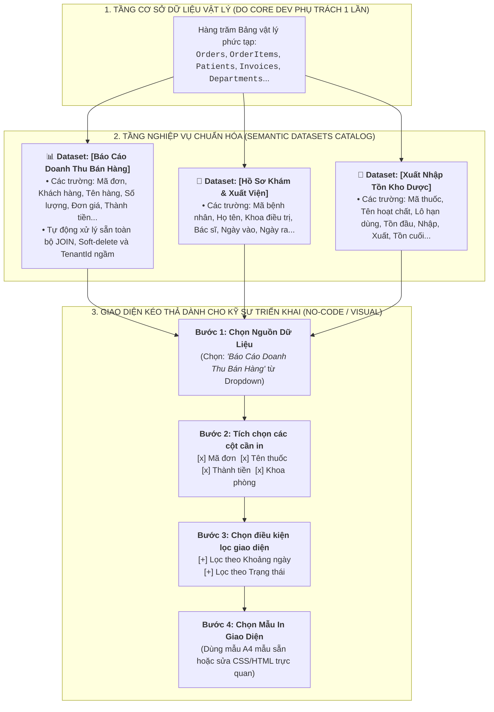

# 🏛️ ĐẶC TẢ THIẾT KẾ: TẦNG DỮ LIỆU NGHIỆP VỤ (SEMANTIC DATASETS) & TRÌNH TẠO BÁO CÁO KÉO THẢ CHO KỸ SƯ TRIỂN KHAI
### (SEMANTIC BUSINESS DATASETS & VISUAL NO-CODE REPORTING PLATFORM SPECIFICATION)

> **Phản biện & Khắc phục lỗ hổng thực tế:** Người đi triển khai, nhân viên hỗ trợ (Support/BA) và Admin bệnh viện **KHÔNG PHẢI LẬP TRÌNH VIÊN DBA**. Họ không thể biết và không được phép nhớ hàng trăm tên bảng vật lý (`tbl_bn_kcb`, `dm_kho_ct`), các khóa ngoại phức tạp hay viết câu lệnh SQL `JOIN` nhiều bảng. Hệ thống cần một **Tầng Dữ Liệu Nghiệp Vụ (Semantic Data Layer)** chuẩn hóa toàn bộ dữ liệu thành các danh mục thân thiện với con người.

---

## I. TỔNG QUAN KIẾN TRÚC 3 TẦNG: TỪ SCHEMA VẬT LÝ ĐẾN NGƯỜI DÙNG TRIỂN KHAI



---

## II. CHI TIẾT CÁC THÀNH PHẦN KỸ THUẬT

### 1. Tầng Semantic Dataset (Định Nghĩa Nguồn Dữ Liệu Nghiệp Vụ Chuẩn)
- Do Core Developer định nghĩa 1 lần duy nhất trong mã nguồn hoặc Database.
- Mỗi Semantic Dataset đại diện cho một chủ đề nghiệp vụ hoàn chỉnh:
  - Tự động đóng gói tất cả các câu `JOIN`, bảo mật `@TenantId`, kiểm tra quyền hạn và loại bỏ các bản ghi đã xóa mềm (`IsDeleted = false`).
  - Phơi bày (expose) danh mục trường (Field Metadata) bằng **tiếng Việt có dấu, rõ nghĩa, có kiểu dữ liệu rõ ràng**.

#### Ví dụ Metadata của Dataset `Sales_Orders_Dataset`:
```json
{
  "datasetCode": "Sales_Orders_Dataset",
  "datasetName": "Dữ liệu Hóa đơn Bán hàng & Dịch vụ",
  "category": "Tài chính & Thu ngân",
  "description": "Bao gồm thông tin hóa đơn, chi tiết dịch vụ, khách hàng và doanh thu",
  "fields": [
    { "key": "OrderNumber", "label": "Mã hóa đơn", "type": "string", "filterable": true },
    { "key": "CustomerName", "label": "Tên khách hàng / Bệnh nhân", "type": "string", "filterable": true },
    { "key": "DepartmentName", "label": "Khoa / Phòng thực hiện", "type": "string", "filterable": true },
    { "key": "ProductName", "label": "Tên dịch vụ / Thuốc", "type": "string", "filterable": true },
    { "key": "Quantity", "label": "Số lượng", "type": "number", "filterable": false },
    { "key": "UnitPrice", "label": "Đơn giá", "type": "currency", "filterable": false },
    { "key": "Total", "label": "Thành tiền", "type": "currency", "filterable": true },
    { "key": "CreatedAt", "label": "Ngày lập phiếu", "type": "date", "filterable": true },
    { "key": "PaymentStatus", "label": "Trạng thái thanh toán", "type": "enum", "filterable": true, "enumValues": ["PAID:Đã thu", "PENDING:Chờ thu", "CANCELLED:Đã hủy"] }
  ]
}
```

---

### 2. Trình Dựng Báo Cáo Kéo Thả Trực Quan (Visual Report Builder Trên Web)
Người đi triển khai không cần viết bất kỳ dòng SQL nào, họ chỉ cần thao tác 4 bước trên giao diện Web:

```
┌────────────────────────────────────────────────────────────────────────────────────────┐
│ 📑 TRÌNH TẠO MẪU BÁO CÁO MỚI (DÀNH CHO KỸ SƯ TRIỂN KHAI)                               │
├────────────────────────────────────────────────────────────────────────────────────────┤
│ 1. Chọn Nguồn Dữ Liệu: [ Báo Cáo Doanh Thu Bán Hàng ▼ ]                                │
│                                                                                        │
│ 2. Tích Chọn Cột Hiển Thị Vào Báo Cáo:                                                 │
│    ☑ Mã hóa đơn (OrderNumber)       ☑ Tên dịch vụ (ProductName)                        │
│    ☑ Khách hàng (CustomerName)      ☑ Thành tiền (Total)                               │
│    ☑ Khoa phòng (DepartmentName)    ☐ Người tạo đơn (CreatedBy)                        │
│                                                                                        │
│ 3. Cấu Hình Bộ Lọc Cho Người Dùng Cuối:                                                │
│    [+ Thêm Bộ Lọc]                                                                     │
│    • Lọc [ Ngày lập phiếu ] theo kiểu [ Khoảng ngày (Date Range) ]                     │
│    • Lọc [ Trạng thái thanh toán ] theo kiểu [ Danh sách chọn (Dropdown) ]              │
│    • Lọc [ Khoa phòng ] theo kiểu [ Chọn nhiều khoa (Multi-select) ]                   │
│                                                                                        │
│ 4. Mẫu In & Định Dạng (Liquid WYSIWYG):                                                │
│    [ Mẫu Bảng Kê Chuẩn A4 ▼ ] (Có sẵn Header, Bảng dữ liệu tự sinh, Chân trang, Tổng tiền)│
│                                                                                        │
│    [ NÚT: XEM THỬ MẪU (PREVIEW) ]        [ NÚT: LƯU & ÁP DỤNG CHO BỆNH VIỆN NÀY ]      │
└────────────────────────────────────────────────────────────────────────────────────────┘
```

---

### 3. Động Cơ Sinh Truy Vấn An Toàn Tự Động (Safe Dynamic Query Synthesizer)
Khi người dùng bấm Lưu:
- Hệ thống **tự động sinh ra câu truy vấn an toàn (Safe AST Query)** dựa trên Dataset và các cột/bộ lọc mà Kỹ sư triển khai đã chọn.
- **Không có bất kỳ nguy cơ SQL Injection nào:** Toàn bộ truy vấn được dịch thông qua Query Object Model đã được kiểm duyệt.
- Tự động sinh sẵn mẫu Liquid HTML cơ bản tương ứng với các cột đã chọn để Kỹ sư triển khai không phải gõ HTML từ đầu.

---

## III. SO SÁNH GIỮA 3 CÁCH TIẾP CẬN

| Tiêu chí | ❌ Cách 1: Code C# | ⚠️ Cách 2: Nhập SQL thuần vào Web | 🏆 Cách 3: Semantic Datasets + Visual Builder |
| :--- | :--- | :--- | :--- |
| **Yêu cầu trình độ người làm** | Lập trình viên Backend .NET | Kỹ sư DBA am hiểu cấu trúc DB | **Bất kỳ Kỹ sư Triển khai / Support / BA nào** |
| **Biết tên bảng vật lý** | Phải biết | Phải thuộc lòng hàng trăm bảng | **Không cần biết (chỉ nhìn thấy tên nghiệp vụ tiếng Việt)** |
| **Nguy cơ lỗi cú pháp** | Thấp | Rất cao (sai tên cột, sai JOIN) | **0% (Hệ thống tự sinh truy vấn an toàn)** |
| **Bảo mật & Đa đơn vị** | Thủ công | Dễ bị bypass nếu quên `@TenantId` | **100% tự động đóng gói sẵn** |
| **Tốc độ cấu hình 1 báo cáo** | 2 - 4 ngày | 30 phút - 2 giờ | **3 - 5 phút (Kéo thả trực tiếp trên Web)** |

---

## IV. BẢNG DỮ LIỆU DATABASE (`SemanticDatasets` & `ReportConfigurations`)

```sql
-- 1. Bảng lưu trữ Danh mục Nguồn Dữ Liệu Nghiệp Vụ do Hệ thống định nghĩa
CREATE TABLE SemanticDatasets (
    Id UUID PRIMARY KEY,
    Code VARCHAR(100) UNIQUE NOT NULL,     -- Ví dụ: Sales_Orders_Dataset
    Name VARCHAR(255) NOT NULL,            -- Ví dụ: Dữ liệu Hóa đơn Bán hàng
    Category VARCHAR(100) NOT NULL,        -- Ví dụ: Tài chính
    Description VARCHAR(500),
    FieldsMetadataJson TEXT NOT NULL,      -- Metadata mô tả danh sách trường (JSON)
    BaseQuerySql TEXT NOT NULL,            -- SQL gốc đã tối ưu hóa JOIN & Index
    IsActive BOOLEAN DEFAULT TRUE,
    CreatedAt TIMESTAMP NOT NULL
);

-- 2. Bảng lưu trữ Cấu hình Báo Cáo do Kỹ Sư Triển Khai tạo ra
CREATE TABLE ReportConfigurations (
    Id UUID PRIMARY KEY,
    TenantId VARCHAR(50) NOT NULL,
    Code VARCHAR(100) NOT NULL,            -- Mã báo cáo
    Name VARCHAR(255) NOT NULL,            -- Tên báo cáo
    DatasetCode VARCHAR(100) NOT NULL,     -- Tham chiếu tới SemanticDatasets
    SelectedFieldsJson TEXT NOT NULL,      -- Danh sách cột được tích chọn
    FilterConfigJson TEXT NOT NULL,        -- Cấu hình các bộ lọc kéo thả
    TemplateContent TEXT NOT NULL,         -- Mẫu Liquid HTML hiển thị
    Version INT DEFAULT 1,
    IsActive BOOLEAN DEFAULT TRUE,
    CreatedAt TIMESTAMP NOT NULL,
    CreatedBy VARCHAR(100) NOT NULL
);

CREATE UNIQUE INDEX idx_report_config_tenant_code ON ReportConfigurations (TenantId, Code);
```

---

## V. KẾ HOẠCH XÁC MINH (VERIFICATION PLAN)

1. **Kiểm tra Danh Mục Semantic Dataset:**
   - Đăng ký Dataset `Sales_Orders_Dataset` với 9 trường nghiệp vụ tiếng Việt.
   - Gọi API `GET /api/reports/semantic-datasets` $\rightarrow$ Xác nhận trả về danh sách trường đầy đủ nhãn tiếng Việt, kiểu dữ liệu, cờ lọc.
2. **Kiểm tra Trình Tạo Báo Cáo Không Cần SQL:**
   - Gửi payload tạo báo cáo mới chỉ định: `DatasetCode = "Sales_Orders_Dataset"`, tích chọn 4 cột `[OrderNumber, CustomerName, ProductName, Total]`, chọn 2 bộ lọc `[DateRange, PaymentStatus]`.
   - Xác nhận: Hệ thống tự động sinh ra cấu hình bộ lọc, câu truy vấn an toàn và mẫu Liquid tương ứng.
3. **Kiểm tra Thực Thi Báo Cáo Thành Phẩm:**
   - Thực hiện in báo cáo vừa tạo bằng bộ lọc ngày tháng $\rightarrow$ Xác nhận dữ liệu được trích xuất chính xác và render ra file PDF/HTML hoàn chỉnh mà người tạo không hề chạm vào 1 câu lệnh SQL hay 1 dòng C#.
