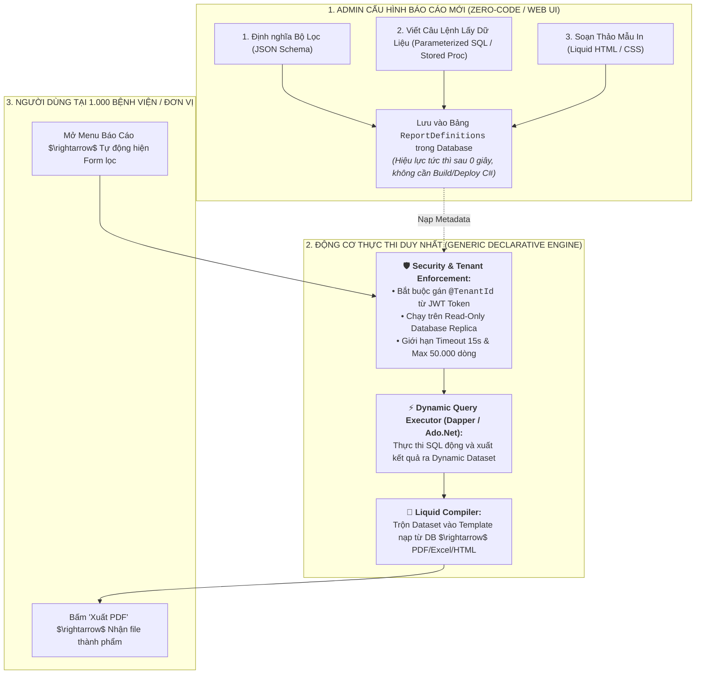

# 🏛️ ĐẶC TẢ THIẾT KẾ: NỀN TẢNG BÁO CÁO ZERO-CODE KHÔNG CẦN VIẾT CODE C#
### (ZERO-CODE DECLARATIVE REPORTING & DATA SOURCE PLATFORM SPECIFICATION)

> **Mục tiêu tối thượng:** Cho phép mở rộng 1.000 đơn vị (Tenants) với hàng nghìn mẫu báo cáo khác nhau **mà KHÔNG CẦN viết thêm dù chỉ 1 class C# hay deploy lại server**. Mọi báo cáo mới được cấu hình hoàn toàn qua giao diện Quản trị (Admin Web) và lưu trữ dưới dạng Metadata trong Cơ sở dữ liệu.

---

## I. TỔNG QUAN KIẾN TRÚC ZERO-CODE (DECLARATIVE METADATA ARCHITECTURE)



---

## II. CHI TIẾT 3 KHỐI METADATA CỦA MỘT BÁO CÁO TRONG DATABASE

Toàn bộ thông tin của một báo cáo nằm trọn vẹn trong **1 bản ghi Database duy nhất** (Bảng `ReportDefinitions`):

### 1. Khối 1: Định Nghĩa Bộ Lọc Giao Diện (`ParameterSchemaJson`)
Frontend tự động vẽ Form lọc dựa vào JSON này:
```json
[
  { "name": "FromDate", "label": "Từ ngày", "type": "date", "required": true, "defaultValue": "first_day_of_month" },
  { "name": "ToDate", "label": "Đến ngày", "type": "date", "required": true, "defaultValue": "today" },
  { "name": "PaymentStatus", "label": "Trạng thái", "type": "select", "options": [{"value":"ALL","label":"Tất cả"},{"value":"PAID","label":"Đã thu"}], "defaultValue": "ALL" },
  { "name": "DepartmentId", "label": "Khoa phòng", "type": "select", "dataSource": "/api/master-data/departments" }
]
```

---

### 2. Khối 2: Định Nghĩa Nguồn Dữ Liệu (`DataSourceQuery`)
Câu lệnh SQL tham số hóa (Parameterized SQL) được lưu trực tiếp trong DB. Hệ thống tự động map các trường từ Form lọc vào các biến `@Parameter`:

```sql
-- Hệ thống tự động bơm @TenantId từ JWT để đảm bảo an toàn 100%
SELECT 
    o.OrderNumber,
    o.CustomerName,
    o.CreatedAt,
    o.TotalAmount,
    oi.ProductName,
    oi.Quantity,
    oi.UnitPrice,
    oi.Total
FROM Orders o
INNER JOIN OrderItems oi ON o.Id = oi.OrderId
WHERE o.TenantId = @TenantId
  AND o.CreatedAt >= @FromDate 
  AND o.CreatedAt <= @ToDate
  AND (@PaymentStatus = 'ALL' OR o.Status = @PaymentStatus)
  AND (@DepartmentId IS NULL OR o.DepartmentId = @DepartmentId)
ORDER BY o.CreatedAt DESC
```

---

### 3. Khối 3: Mẫu In Giao Diện (`TemplateContent`)
Nội dung file Liquid HTML/CSS trực tiếp trong DB:
```html
<h1>BÁO CÁO DOANH THU KHOA PHÒNG: {{ Data[0].CustomerName }}</h1>
<table>
  
  <tr>
    <td>{{ row.OrderNumber }}</td>
    <td>{{ row.ProductName }}</td>
    <td>{{ row.Total | format_currency: 'VND' }}</td>
  </tr>
  
</table>
```

---

## III. CÁC HÀNG RÀO BẢO MẬT & CHỐNG SẬP DATABASE (PRODUCTION SAFETY GUARDS)

Khi cho phép lưu SQL trong Database, hệ thống bắt buộc kích hoạt **4 lớp bảo vệ nghiêm ngặt**:

| Lớp bảo vệ | Cơ chế kiểm soát | Hậu quả ngăn chặn |
| :--- | :--- | :--- |
| **1. Chống SQL Injection & Vượt Tenant** | Bắt buộc dùng `Dapper DynamicParameters`, tự động gán `@TenantId = User.TenantId`. Cấm tuyệt đối nối chuỗi SQL (`string.Concat`). | Ngăn chặn việc xem trộm dữ liệu của đơn vị khác. |
| **2. Read-Only DB Connection** | Tách riêng chuỗi kết nối `ReportingDbReadOnlyConnection` (chỉ cấp quyền `SELECT`). Chặn toàn bộ lệnh `DROP`, `DELETE`, `UPDATE`, `INSERT`. | Đảm bảo an toàn 100% cho dữ liệu giao dịch gốc. |
| **3. Giới Hạn Thời Gian (Query Timeout)** | Đặt cờ `CommandTimeout = 15 giây`. Nếu câu SQL viết kém bị treo/quét bảng quá lâu $\rightarrow$ Hệ thống tự ngắt kết nối. | Tránh khóa bảng (Deadlock) và nghẽn CPU của Database chính. |
| **4. Giới Hạn Số Bản Ghi (Row Limit)** | Tự động chèn cờ `TOP 50000` / `LIMIT 50000` cho các báo cáo in nhanh trên giao diện. | Ngăn chặn việc kéo hàng triệu dòng gây tràn RAM. |

---

## IV. BẢNG DỮ LIỆU DATABASE (`ReportDefinitions`)

```sql
CREATE TABLE ReportDefinitions (
    Id UUID PRIMARY KEY,
    Code VARCHAR(100) NOT NULL,
    Name VARCHAR(255) NOT NULL,
    Category VARCHAR(100) NOT NULL,
    Description VARCHAR(500),
    
    -- 3 Khối Declarative Metadata
    ParameterSchemaJson TEXT NOT NULL,
    DataSourceQuery TEXT NOT NULL,
    TemplateContent TEXT NOT NULL,
    
    IsActive BOOLEAN DEFAULT TRUE,
    IsSystemDefault BOOLEAN DEFAULT FALSE,
    TenantId VARCHAR(50) NOT NULL,
    Version INT DEFAULT 1,
    CreatedAt TIMESTAMP NOT NULL,
    CreatedBy VARCHAR(100) NOT NULL
);

CREATE UNIQUE INDEX idx_report_definitions_tenant_code ON ReportDefinitions (TenantId, Code);
```

---

## V. SO SÁNH HIỆU QUẢ VẬN HÀNH

| Tiêu chí | ❌ Cách cũ (Code C# Class Provider) | 🏆 Nền tảng Zero-Code Mới |
| :--- | :--- | :--- |
| **Thêm 100 báo cáo mới** | Viết 100 file `.cs`, sửa DI, commit git, build, restart server $\rightarrow$ **Mất hàng tuần**. | Admin chỉ cần paste SQL và Template lên Web Admin $\rightarrow$ **Mất 5 phút, không cần restart server**. |
| **Tùy biến riêng cho 1.000 đơn vị** | Bùng nổ mã nguồn, dễ xung đột logic giữa các đơn vị. | Mỗi đơn vị tự cấu hình câu SQL/Template riêng được lưu gọn trong DB của họ. |
| **Quy mô triển khai** | Cồng kềnh, tốn nhân lực lập trình viên hỗ trợ bảo trì. | **Mở rộng cực đại (Infinite Scalability)** với chi phí nhân lực gần như bằng 0. |

---

## VI. KẾ HOẠCH XÁC MINH (VERIFICATION PLAN)

1. **Kiểm thử Tạo Báo Cáo Không Cần Code:**
   - Dùng API gửi 1 bộ cấu hình `{ Code, ParameterSchemaJson, DataSourceQuery, TemplateContent }` vào Database.
   - Gọi ngay lập tức API `POST /api/reports/declarative/execute` $\rightarrow$ Xác nhận dữ liệu được query từ DB, trộn vào Liquid và xuất ra PDF thành công 100%.
2. **Kiểm thử An Toàn Cách Ly Tenant:**
   - Kiểm tra xem câu SQL có tự động lọc theo `TenantId` của người đăng nhập hay không, đảm bảo không thể xem chéo dữ liệu của Tenant khác.
3. **Kiểm thử Timeout & Read-Only:**
   - Gửi thử câu SQL có chứa lệnh `DELETE` $\rightarrow$ Xác nhận hệ thống chặn và trả lỗi từ chối ngay lập tức.
